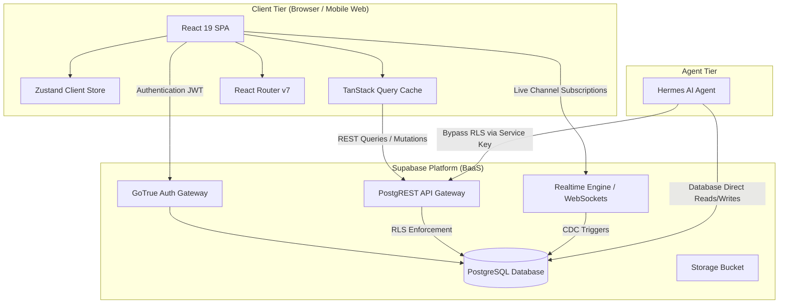
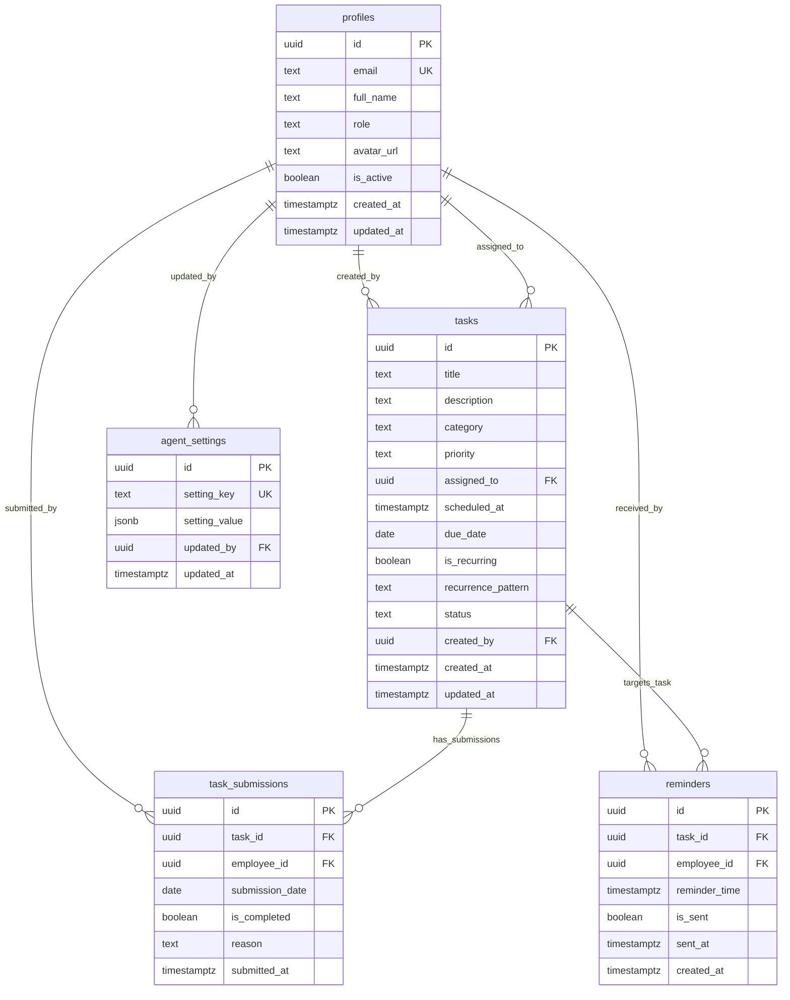
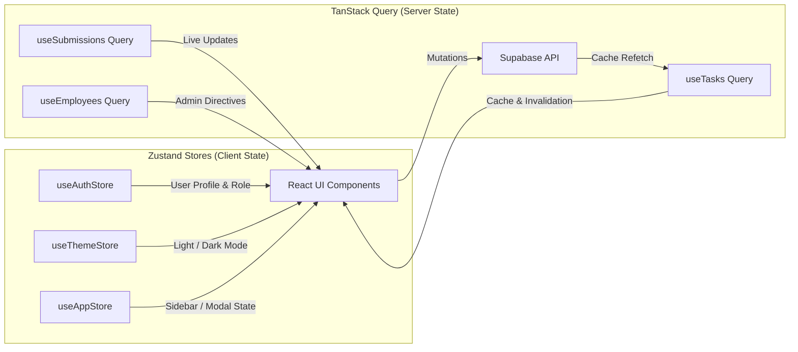
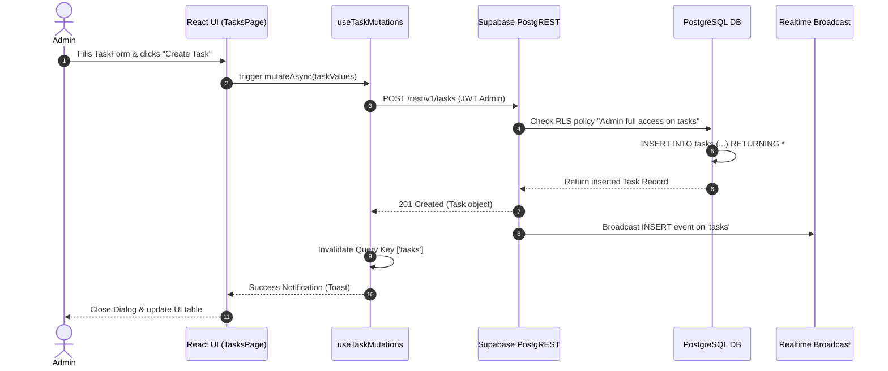
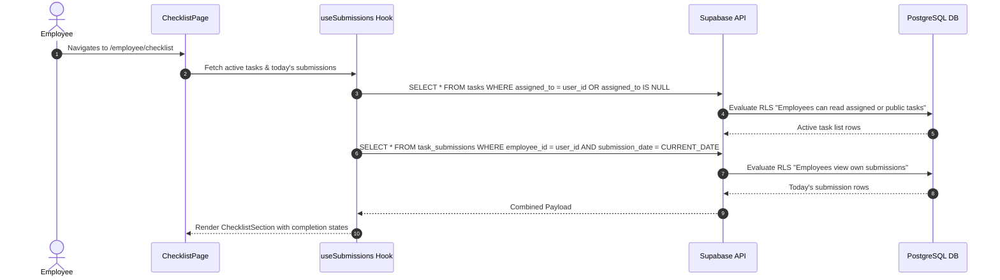
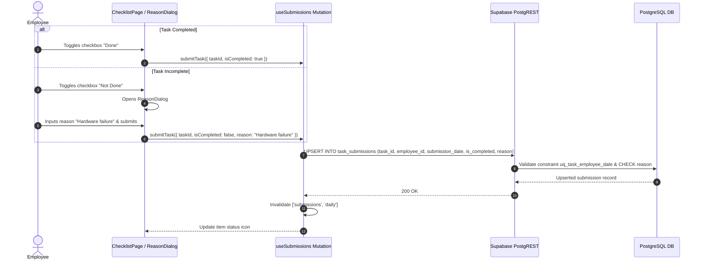
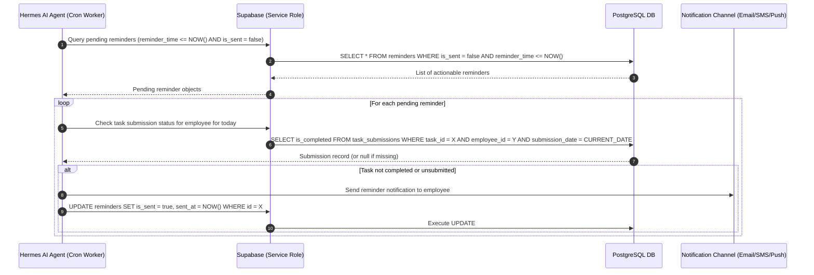
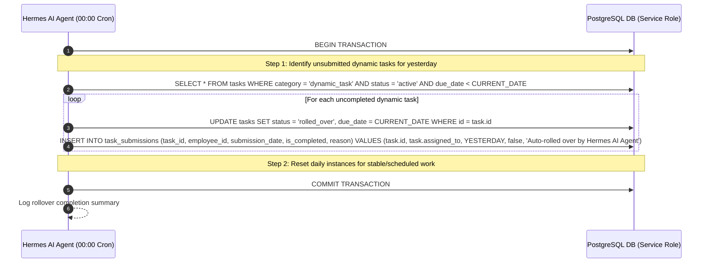

# TaskAgent — System Design & Architecture Document

**Project Name:** TaskAgent  
**Document Version:** 1.0.0  
**Target Environment:** Production / Web  
**Primary Architecture Pattern:** Supabase-Driven Serverless Architecture with AI Agent Integration  

---

## 1. Executive Summary & Core Objectives

**TaskAgent** is an enterprise-grade task management system and administrative dashboard built to streamline operational task delegation, daily checklist compliance, progress tracking, and automated reminder management.

### Key Objectives
1. **Role-Based Task Operations:** Provide customized interfaces for **Admins** (task creation, employee assignment, analytics, agent settings, and historical reporting) and **Employees** (daily task checklists, execution reporting, exception reason logging).
2. **Serverless Supabase Core:** Leverage Supabase for direct client authentication, PostgreSQL relational data persistence, real-time state synchronization, and fine-grained Row-Level Security (RLS) enforcement without maintaining a custom server runtime.
3. **Autonomous Agent Integration:** Enable the **Hermes AI Agent** to interface directly with the database using Supabase's service role key to process daily task rollovers, evaluate submission compliance, and trigger timely notifications.
4. **Optimized Frontend Experience:** Built with React 19, Vite 8, TypeScript, Tailwind CSS v4, and shadcn/ui components for high performance, accessibility, responsive UI across mobile/desktop, and instantaneous real-time UI updates via TanStack Query and Zustand.

---

## 2. Tech Stack Specification

| Tier / Domain | Technology | Version | Purpose & Rationale |
| :--- | :--- | :--- | :--- |
| **Runtime & PM** | [Bun](https://bun.sh/) | ^1.2.0 | Ultra-fast JavaScript runtime, package manager, and script runner replacing Node.js/npm for rapid builds and dependency resolution. |
| **Frontend Library** | [React](https://react.dev/) | 19.x | Modern UI framework utilizing the React 19 Concurrent Renderer, Server Actions ready patterns, and strict hook rules. |
| **Build System** | [Vite](https://vite.dev/) | 8.x | High-efficiency HMR build tool providing instant server start and optimized production bundling with ESBuild. |
| **Language** | [TypeScript](https://www.typescriptlang.org/) | 5.x | End-to-end type safety, automated type generation from Supabase PostgreSQL schema, and strict compilation checks. |
| **Styling & UI** | [Tailwind CSS](https://tailwindcss.com/) v4 + [shadcn/ui](https://ui.shadcn.com/) | v4.x | Utility-first styling engine using modern OKLCH CSS variables and accessible, unstyled Radix UI primitives. |
| **Routing** | [React Router](https://reactrouter.com/) | v7 | Declarative nested routing, path parameters, protected route guards, and layout wrapping. |
| **Global State** | [Zustand](https://zustand-demo.pmnd.rs/) | ^5.0 | Lightweight client state management for active session data, UI layout toggles, theme preferences, and modal drawers. |
| **Server State** | [TanStack Query](https://tanstack.com/query) | v5 | Robust data fetching, stale-while-revalidate caching, optimistic mutations, background sync, and cache invalidation. |
| **Form Management**| [React Hook Form](https://react-hook-form.com/) + [Zod](https://zod.dev/) | ^7.50 / ^3.23 | Uncontrolled form inputs with schema-based validation, automatic error mapping, and type inference. |
| **Backend & DB** | [Supabase](https://supabase.com/) | JS SDK v2 | PostgreSQL DB, Auth (JWT/OAuth), Realtime WebSockets, Storage, and Row Level Security engine. |
| **Iconography** | [Lucide React](https://lucide.dev/) | Latest | Vector icon suite optimized for React with dynamic tree-shaking support. |

---

## 3. High-Level Architecture

TaskAgent adopts a **Supabase-Driven Serverless Architecture**. The React Single Page Application (SPA) communicates directly with Supabase API gateways (`PostgREST`, `GoTrue` Auth, and `Realtime` WebSockets) using standard JWT-authenticated HTTPS and WSS connections. 

The **Hermes AI Agent** runs as an autonomous system task, connecting to Supabase via the elevated `SUPABASE_SERVICE_ROLE_KEY` to perform administrative operations, task rollover logic, compliance analysis, and automated reminder dispatches.



---

## 4. Folder Architecture (Feature + Page Hybrid)

The project structure organizes shared primitives, global layouts, page routes, and domain-driven feature modules cleanly to maximize maintainability and scalability.

```
src/
├── api/                        # Supabase client & low-level API call wrappers
│   ├── supabase.ts             # Supabase client initialization & instance export
│   ├── auth.ts                 # Authentication SDK methods (signIn, signOut, getSession)
│   ├── tasks.ts                # Task CRUD endpoints and query builder functions
│   ├── submissions.ts          # Submission persistence and daily report queries
│   └── employees.ts            # Profile & employee management API helpers
├── components/                 # Reusable layout and UI components
│   ├── ui/                     # Primitives (Button, Card, Dialog, Input, Table, etc.)
│   ├── layout/                 # Main framing components
│   │   ├── Navbar.tsx          # Top navigation header with user profile menu
│   │   ├── Sidebar.tsx         # Desktop collapsible side navigation
│   │   ├── Footer.tsx          # Application footer containing build metadata
│   │   └── MobileNav.tsx       # Bottom navigation / slide-out drawer for small screens
│   ├── forms/                  # Reusable form primitives
│   │   ├── TaskForm.tsx        # Add/edit task schema form
│   │   ├── EmployeeForm.tsx    # Employee creation and role update form
│   │   └── LoginForm.tsx       # Authentication credentials form
│   └── shared/                 # Business-agnostic generic UI widgets
│       ├── StatusBadge.tsx     # Color-coded badge for task/submission statuses
│       ├── TaskCard.tsx        # Standard task container card with metadata
│       ├── ChecklistItem.tsx   # Interactive task item with toggle & reason prompt
│       ├── EmptyState.tsx      # Zero-state placeholder graphic & text component
│       └── LoadingSpinner.tsx  # Universal loading indicator overlay
├── features/                   # Feature-based domain modules (encapsulated logic)
│   ├── auth/
│   │   ├── hooks/
│   │   │   └── useAuth.ts      # Auth status subscriber hook
│   │   ├── components/
│   │   │   └── ProtectedRoute.tsx # Route guard checking session & user roles
│   │   └── store/
│   │       └── useAuthStore.ts # Current session & cached profile state
│   ├── tasks/
│   │   ├── hooks/
│   │   │   ├── useTasks.ts          # Query hook fetching active/filtered task lists
│   │   │   └── useTaskMutations.ts # Mutations for task creation, edits, deletion
│   │   ├── components/
│   │   │   ├── TaskList.tsx        # Data table / grid view for task entries
│   │   │   ├── TaskFilters.tsx     # Filter bar (category, priority, assignee)
│   │   │   └── TaskDialog.tsx      # Modal wrapper for TaskForm
│   │   └── types.ts                # Task domain specific interfaces
│   ├── submissions/
│   │   ├── hooks/
│   │   │   └── useSubmissions.ts    # Daily submission state & submission mutation
│   │   └── components/
│   │       ├── ChecklistSection.tsx # Grouped list of tasks for daily checklist
│   │       ├── ReasonDialog.tsx     # Dialog prompting for reason on uncompleted tasks
│   │       └── SubmitButton.tsx     # CTA button firing batch submission payload
│   └── employees/
│       ├── hooks/
│       │   └── useEmployees.ts      # Query hook fetching all profiles with roles
│       └── components/
│           ├── EmployeeTable.tsx    # Data table for administrative user management
│           └── EmployeeDialog.tsx   # Modal for provisioning employee accounts
├── hooks/                      # App-wide utility custom hooks
│   └── useMediaQuery.ts        # Responsive breakpoint detector hook
├── layouts/                    # Structure layout wrappers for routes
│   ├── AuthLayout.tsx          # Centered layout for login and access pages
│   ├── AdminLayout.tsx         # Sidebar + Topbar wrapper for Admin routes
│   └── EmployeeLayout.tsx      # Mobile-optimized single column wrapper for Employees
├── lib/                        # Core utilities and static configuration
│   ├── utils.ts                # Tailwind merge (cn helper), date formatting, maskers
│   └── constants.ts            # Category enums, default routes, query key constants
├── pages/                      # Page components connected to React Router routes
│   ├── auth/
│   │   └── LoginPage.tsx       # Auth entry screen
│   ├── admin/
│   │   ├── DashboardPage.tsx   # Operational overview & analytics summary widgets
│   │   ├── TasksPage.tsx       # Task management overview table & CRUD actions
│   │   ├── EmployeesPage.tsx   # Team directory and activation toggles
│   │   ├── ReportsPage.tsx     # Historical submission compliance reports
│   │   └── SettingsPage.tsx    # Reminder trigger rules & Hermes AI agent settings
│   ├── employee/
│   │   └── ChecklistPage.tsx   # Daily task execution list for employees
│   └── NotFoundPage.tsx        # 404 Error page
├── providers/                  # Application Context & Provider Wrappers
│   ├── QueryProvider.tsx       # TanStack Query Client provider & configuration
│   └── AuthProvider.tsx        # Supabase auth listener and initial session hydrator
├── store/                      # Global Zustand state containers
│   ├── useThemeStore.ts        # Dark/Light mode theme state with localStorage persistence
│   └── useAppStore.ts          # Global UI state (sidebar state, active toasts)
├── types/                      # Global TypeScript Definitions
│   ├── database.ts             # Supabase generated PostgreSQL database interfaces
│   ├── auth.ts                 # User session, JWT payload, and role definitions
│   └── index.ts                # Barrell re-export for clean root imports
├── index.css                   # Global Tailwind CSS v4 setup and OKLCH color rules
└── main.tsx                    # React DOM bootstrapper and root component mount
```

---

## 5. Database Schema Blueprint (Supabase PostgreSQL)

The backend data model relies on five core tables hosted in PostgreSQL with complete referential integrity, constraints, indexes, and triggers.



### PostgreSQL DDL Script

```sql
-- Enable UUID extension
CREATE EXTENSION IF NOT EXISTS "uuid-ossp";

-- Automated updated_at timestamp trigger function
CREATE OR REPLACE FUNCTION update_updated_at_column()
RETURNS TRIGGER AS $$
BEGIN
    NEW.updated_at = NOW();
    RETURN NEW;
END;
$$ LANGUAGE plpgsql;

-------------------------------------------------------------------------------
-- 1. PROFILES TABLE
-------------------------------------------------------------------------------
CREATE TABLE public.profiles (
    id UUID PRIMARY KEY REFERENCES auth.users(id) ON DELETE CASCADE,
    email TEXT NOT NULL UNIQUE,
    full_name TEXT NOT NULL,
    role TEXT NOT NULL DEFAULT 'employee' CHECK (role IN ('admin', 'employee')),
    avatar_url TEXT NULL,
    is_active BOOLEAN NOT NULL DEFAULT true,
    created_at TIMESTAMPTZ NOT NULL DEFAULT NOW(),
    updated_at TIMESTAMPTZ NOT NULL DEFAULT NOW()
);

CREATE TRIGGER update_profiles_updated_at
    BEFORE UPDATE ON public.profiles
    FOR EACH ROW EXECUTE FUNCTION update_updated_at_column();

-------------------------------------------------------------------------------
-- 2. TASKS TABLE
-------------------------------------------------------------------------------
CREATE TABLE public.tasks (
    id UUID PRIMARY KEY DEFAULT gen_random_uuid(),
    title TEXT NOT NULL,
    description TEXT NULL,
    category TEXT NOT NULL CHECK (category IN ('dynamic_task', 'stable_work', 'scheduled_task')),
    priority TEXT NOT NULL DEFAULT 'medium' CHECK (priority IN ('low', 'medium', 'high', 'urgent')),
    assigned_to UUID NULL REFERENCES public.profiles(id) ON DELETE SET NULL,
    scheduled_at TIMESTAMPTZ NULL,
    due_date DATE NULL,
    is_recurring BOOLEAN NOT NULL DEFAULT false,
    recurrence_pattern TEXT NULL,
    status TEXT NOT NULL DEFAULT 'active' CHECK (status IN ('active', 'completed', 'cancelled', 'rolled_over')),
    created_by UUID NOT NULL REFERENCES public.profiles(id) ON DELETE RESTRICT,
    created_at TIMESTAMPTZ NOT NULL DEFAULT NOW(),
    updated_at TIMESTAMPTZ NOT NULL DEFAULT NOW()
);

CREATE INDEX idx_tasks_assigned_to ON public.tasks(assigned_to);
CREATE INDEX idx_tasks_category ON public.tasks(category);
CREATE INDEX idx_tasks_status ON public.tasks(status);
CREATE INDEX idx_tasks_due_date ON public.tasks(due_date);

CREATE TRIGGER update_tasks_updated_at
    BEFORE UPDATE ON public.tasks
    FOR EACH ROW EXECUTE FUNCTION update_updated_at_column();

-------------------------------------------------------------------------------
-- 3. TASK_SUBMISSIONS TABLE
-------------------------------------------------------------------------------
CREATE TABLE public.task_submissions (
    id UUID PRIMARY KEY DEFAULT gen_random_uuid(),
    task_id UUID NOT NULL REFERENCES public.tasks(id) ON DELETE CASCADE,
    employee_id UUID NOT NULL REFERENCES public.profiles(id) ON DELETE CASCADE,
    submission_date DATE NOT NULL DEFAULT CURRENT_DATE,
    is_completed BOOLEAN NOT NULL,
    reason TEXT NULL,
    submitted_at TIMESTAMPTZ NOT NULL DEFAULT NOW(),
    CONSTRAINT uq_task_employee_date UNIQUE (task_id, employee_id, submission_date),
    CONSTRAINT chk_reason_if_uncompleted CHECK (is_completed = true OR (is_completed = false AND reason IS NOT NULL AND length(trim(reason)) > 0))
);

CREATE INDEX idx_submissions_employee_date ON public.task_submissions(employee_id, submission_date);
CREATE INDEX idx_submissions_task_id ON public.task_submissions(task_id);

-------------------------------------------------------------------------------
-- 4. AGENT_SETTINGS TABLE
-------------------------------------------------------------------------------
CREATE TABLE public.agent_settings (
    id UUID PRIMARY KEY DEFAULT gen_random_uuid(),
    setting_key TEXT NOT NULL UNIQUE,
    setting_value JSONB NOT NULL,
    updated_by UUID NULL REFERENCES public.profiles(id) ON DELETE SET NULL,
    updated_at TIMESTAMPTZ NOT NULL DEFAULT NOW()
);

CREATE TRIGGER update_agent_settings_updated_at
    BEFORE UPDATE ON public.agent_settings
    FOR EACH ROW EXECUTE FUNCTION update_updated_at_column();

-------------------------------------------------------------------------------
-- 5. REMINDERS TABLE
-------------------------------------------------------------------------------
CREATE TABLE public.reminders (
    id UUID PRIMARY KEY DEFAULT gen_random_uuid(),
    task_id UUID NULL REFERENCES public.tasks(id) ON DELETE CASCADE,
    employee_id UUID NULL REFERENCES public.profiles(id) ON DELETE CASCADE,
    reminder_time TIMESTAMPTZ NOT NULL,
    is_sent BOOLEAN NOT NULL DEFAULT false,
    sent_at TIMESTAMPTZ NULL,
    created_at TIMESTAMPTZ NOT NULL DEFAULT NOW()
);

CREATE INDEX idx_reminders_is_sent_time ON public.reminders(is_sent, reminder_time);
```

---

## 6. Row Level Security (RLS) Policy Blueprint

Row Level Security is enabled on every table in the `public` schema. All operations are strictly evaluated against the requesting user's authenticated JWT claims.

### Security Principles
1. **Admins:** Identified by `role = 'admin'` in their `public.profiles` row. Admins possess full SELECT, INSERT, UPDATE, and DELETE privileges across all tables.
2. **Employees:** Identified by `role = 'employee'`. Employees can read their own profile, read active tasks assigned directly to them or unassigned (broadcasted to all), and insert/update their own submissions.
3. **Service Role (Hermes AI Agent):** Requests authenticated with the Supabase Service Role Key bypass RLS automatically at the database engine level.

```sql
-- Enable RLS on all tables
ALTER TABLE public.profiles ENABLE ROW LEVEL SECURITY;
ALTER TABLE public.tasks ENABLE ROW LEVEL SECURITY;
ALTER TABLE public.task_submissions ENABLE ROW LEVEL SECURITY;
ALTER TABLE public.agent_settings ENABLE ROW LEVEL SECURITY;
ALTER TABLE public.reminders ENABLE ROW LEVEL SECURITY;

-------------------------------------------------------------------------------
-- HELPER FUNCTIONS FOR RLS
-------------------------------------------------------------------------------
CREATE OR REPLACE FUNCTION public.is_admin()
RETURNS BOOLEAN AS $$
BEGIN
  RETURN EXISTS (
    SELECT 1 FROM public.profiles
    WHERE id = auth.uid() AND role = 'admin' AND is_active = true
  );
END;
$$ LANGUAGE plpgsql SECURITY DEFINER;

-------------------------------------------------------------------------------
-- 1. PROFILES POLICIES
-------------------------------------------------------------------------------
-- Admins can read all profiles
CREATE POLICY "Admin full access on profiles"
    ON public.profiles FOR ALL
    USING (public.is_admin());

-- Employees can view active profiles (for member directories)
CREATE POLICY "Employees can view active profiles"
    ON public.profiles FOR SELECT
    USING (auth.role() = 'authenticated' AND is_active = true);

-- Employees can update their own profile avatar/full_name
CREATE POLICY "Employees can update self profile"
    ON public.profiles FOR UPDATE
    USING (id = auth.uid())
    WITH CHECK (id = auth.uid() AND role = (SELECT role FROM public.profiles WHERE id = auth.uid()));

-------------------------------------------------------------------------------
-- 2. TASKS POLICIES
-------------------------------------------------------------------------------
-- Admin full access on tasks
CREATE POLICY "Admin full access on tasks"
    ON public.tasks FOR ALL
    USING (public.is_admin());

-- Employees can read tasks assigned to them OR assigned to everyone (assigned_to IS NULL)
CREATE POLICY "Employees can read assigned or public tasks"
    ON public.tasks FOR SELECT
    USING (
        auth.role() = 'authenticated' 
        AND status IN ('active', 'rolled_over')
        AND (assigned_to = auth.uid() OR assigned_to IS NULL)
    );

-------------------------------------------------------------------------------
-- 3. TASK_SUBMISSIONS POLICIES
-------------------------------------------------------------------------------
-- Admin full access on submissions
CREATE POLICY "Admin full access on submissions"
    ON public.task_submissions FOR ALL
    USING (public.is_admin());

-- Employees can view their own submissions
CREATE POLICY "Employees view own submissions"
    ON public.task_submissions FOR SELECT
    USING (employee_id = auth.uid());

-- Employees can insert their own submissions
CREATE POLICY "Employees insert own submissions"
    ON public.task_submissions FOR INSERT
    WITH CHECK (
        employee_id = auth.uid() 
        AND EXISTS (
            SELECT 1 FROM public.tasks 
            WHERE id = task_id 
            AND (assigned_to = auth.uid() OR assigned_to IS NULL)
            AND status IN ('active', 'rolled_over')
        )
    );

-- Employees can update their own submission on the same submission date
CREATE POLICY "Employees update own submissions for today"
    ON public.task_submissions FOR UPDATE
    USING (employee_id = auth.uid() AND submission_date = CURRENT_DATE)
    WITH CHECK (employee_id = auth.uid() AND submission_date = CURRENT_DATE);

-------------------------------------------------------------------------------
-- 4. AGENT_SETTINGS POLICIES
-------------------------------------------------------------------------------
-- Admin full access on agent settings
CREATE POLICY "Admin full access on agent_settings"
    ON public.agent_settings FOR ALL
    USING (public.is_admin());

-- Authenticated users can read agent settings (e.g. reminder schedules)
CREATE POLICY "Authenticated users read agent_settings"
    ON public.agent_settings FOR SELECT
    USING (auth.role() = 'authenticated');

-------------------------------------------------------------------------------
-- 5. REMINDERS POLICIES
-------------------------------------------------------------------------------
-- Admin full access on reminders
CREATE POLICY "Admin full access on reminders"
    ON public.reminders FOR ALL
    USING (public.is_admin());

-- Employees can view reminders sent to them
CREATE POLICY "Employees view own reminders"
    ON public.reminders FOR SELECT
    USING (employee_id = auth.uid());
```

---

## 7. Frontend Component Architecture & Specs

Each component is written using TypeScript with strict interfaces, zero `any` types, and proper UI decomposition.

### Key Component Interfaces & Hierarchy

#### `TaskCard.tsx`
Displays individual task information within lists or grids.

```typescript
// src/components/shared/TaskCard.tsx
import React from 'react';
import { Task } from '@/types';

export interface TaskCardProps {
  task: Task;
  onEdit?: (task: Task) => void;
  onDelete?: (taskId: string) => void;
  showAssignee?: boolean;
  isCompact?: boolean;
}

export const TaskCard: React.FC<TaskCardProps> = ({
  task,
  onEdit,
  onDelete,
  showAssignee = true,
  isCompact = false,
}) => {
  // Renders card with priority border, title, description, category badge, and action buttons
  return (
    <div className={`rounded-lg border p-4 shadow-sm transition-all ${isCompact ? 'py-2' : 'py-4'}`}>
      {/* Component details */}
    </div>
  );
};
```

#### `ChecklistItem.tsx`
Primary interactive UI element on the employee checklist screen.

```typescript
// src/components/shared/ChecklistItem.tsx
import React from 'react';
import { Task, TaskSubmission } from '@/types';

export interface ChecklistItemProps {
  task: Task;
  submission?: TaskSubmission;
  onToggleComplete: (taskId: string, completed: boolean) => void;
  onRequestReason: (task: Task) => void;
  disabled?: boolean;
}

export const ChecklistItem: React.FC<ChecklistItemProps> = ({
  task,
  submission,
  onToggleComplete,
  onRequestReason,
  disabled = false,
}) => {
  const isChecked = submission?.is_completed ?? false;
  
  return (
    <div className="flex items-start justify-between gap-4 p-4 border-b last:border-0">
      {/* Checkbox trigger, task details, and status indicator */}
    </div>
  );
};
```

#### `ReasonDialog.tsx`
Modal dialog forcing an employee to provide a mandatory justification when marking a task incomplete.

```typescript
// src/features/submissions/components/ReasonDialog.tsx
import React from 'react';
import { Task } from '@/types';

export interface ReasonDialogProps {
  isOpen: boolean;
  task: Task | null;
  onClose: () => void;
  onSubmitReason: (taskId: string, reason: string) => Promise<void>;
  isLoading?: boolean;
}
```

#### `TaskForm.tsx`
Controlled form for creating and updating tasks.

```typescript
// src/components/forms/TaskForm.tsx
import { z } from 'zod';

export const taskFormSchema = z.object({
  title: z.string().min(3, 'Title must be at least 3 characters'),
  description: z.string().optional(),
  category: z.enum(['dynamic_task', 'stable_work', 'scheduled_task']),
  priority: z.enum(['low', 'medium', 'high', 'urgent']),
  assigned_to: z.string().nullable().optional(),
  scheduled_at: z.string().nullable().optional(),
  due_date: z.string().nullable().optional(),
  is_recurring: z.boolean().default(false),
  recurrence_pattern: z.string().nullable().optional(),
});

export type TaskFormValues = z.infer<typeof taskFormSchema>;

export interface TaskFormProps {
  initialValues?: Partial<TaskFormValues>;
  onSubmit: (values: TaskFormValues) => Promise<void>;
  onCancel: () => void;
  isSubmitting?: boolean;
  employees: { id: string; full_name: string }[];
}
```

---

## 8. State Management & Data Fetching Strategy

TaskAgent separates **Server State** (managed via TanStack Query) from **Client UI State** (managed via Zustand).



### 1. TanStack Query Configuration
- **Stale Time:** 2 minutes for task lists, 30 seconds for daily submissions.
- **Garbage Collection Time (gcTime):** 10 minutes.
- **Cache Key Hierarchy:**
  - `['tasks', 'list', { category, priority, status }]`
  - `['tasks', 'detail', taskId]`
  - `['submissions', 'daily', { date, employeeId }]`
  - `['employees', 'list']`
  - `['agent-settings']`

### 2. Zustand Store Implementations

#### `useAuthStore.ts`
```typescript
// src/features/auth/store/useAuthStore.ts
import { create } from 'zustand';
import { User, Session } from '@supabase/supabase-js';
import { Profile } from '@/types';

interface AuthState {
  user: User | null;
  profile: Profile | null;
  session: Session | null;
  isLoading: boolean;
  setSession: (session: Session | null) => void;
  setProfile: (profile: Profile | null) => void;
  setLoading: (isLoading: boolean) => void;
  reset: () => void;
}

export const useAuthStore = create<AuthState>((set) => ({
  user: null,
  profile: null,
  session: null,
  isLoading: true,
  setSession: (session) => set({ session, user: session?.user ?? null }),
  setProfile: (profile) => set({ profile }),
  setLoading: (isLoading) => set({ isLoading }),
  reset: () => set({ user: null, profile: null, session: null, isLoading: false }),
}));
```

---

## 9. Data Flow Specifications

### Workflow 1: Admin Task Creation & Assignment



---

### Workflow 2: Employee Checklist Hydration



---

### Workflow 3: Daily Submission & Exception Logging



---

### Workflow 4: Hermes AI Agent Reminder Dispatch



---

### Workflow 5: End-of-Day Task Rollover Engine



---

## 10. Real-time Subscription Architecture

TaskAgent leverages Supabase Realtime (powered by PostgreSQL Change Data Capture - CDC) to push instant updates to active client sessions without expensive polling.

### 1. Admin Dashboard Subscription (`task_submissions`)
Admins receive live updates whenever an employee submits or alters a daily task status.

```typescript
// src/features/submissions/hooks/useRealtimeSubmissions.ts
import { useEffect } from 'react';
import { useQueryClient } from '@tanstack/react-query';
import { supabase } from '@/api/supabase';

export const useRealtimeSubmissions = () => {
  const queryClient = useQueryClient();

  useEffect(() => {
    const channel = supabase
      .channel('admin-submissions-changes')
      .on(
        'postgres_changes',
        {
          event: '*', // Listen to INSERT, UPDATE, DELETE
          schema: 'public',
          table: 'task_submissions',
        },
        (payload) => {
          // Invalidate admin dashboard reports and live metrics queries
          queryClient.invalidateQueries({ queryKey: ['submissions'] });
          queryClient.invalidateQueries({ queryKey: ['reports'] });
        }
      )
      .subscribe();

    return () => {
      supabase.removeChannel(channel);
    };
  }, [queryClient]);
};
```

### 2. Employee Checklist Subscription (`tasks`)
Employees receive automatic updates on their checklist when an admin assigns a new task or updates task directives.

```typescript
// src/features/tasks/hooks/useRealtimeTasks.ts
import { useEffect } from 'react';
import { useQueryClient } from '@tanstack/react-query';
import { supabase } from '@/api/supabase';
import { useAuthStore } from '@/features/auth/store/useAuthStore';

export const useRealtimeTasks = () => {
  const queryClient = useQueryClient();
  const user = useAuthStore((state) => state.user);

  useEffect(() => {
    if (!user) return;

    const channel = supabase
      .channel(`employee-tasks-${user.id}`)
      .on(
        'postgres_changes',
        {
          event: '*',
          schema: 'public',
          table: 'tasks',
        },
        (payload) => {
          // Trigger invalidation for tasks assigned to this user or global tasks
          queryClient.invalidateQueries({ queryKey: ['tasks'] });
        }
      )
      .subscribe();

    return () => {
      supabase.removeChannel(channel);
    };
  }, [user, queryClient]);
};
```

---

## 11. Responsive Design Strategy

The application enforces a **Mobile-First Responsive Strategy** utilizing Tailwind CSS v4 OKLCH color palettes and dynamic layout reflows.

### Breakpoint Conventions

| Breakpoint | Minimum Width | Target Devices | Layout Adaptations |
| :--- | :--- | :--- | :--- |
| `default` | `< 640px` | Mobile Phones | Full width cards, sticky bottom nav bar, single column stacked layouts, drawer modals. |
| `sm` | `640px` | Large Phones / Small Tablets | Grid layout switching (2 columns for metrics), condensed padding. |
| `md` | `768px` | Tablets / Small Laptops | Collapsible sidebar, data tables enable scroll overflow or column toggle. |
| `lg` | `1024px` | Laptops / Desktops | Fixed dual-pane sidebar + main content area, full multi-column admin data tables. |
| `xl` | `1280px` | Large Monitors | Max content width constraint (`max-w-7xl`), multi-widget analytical dashboards. |

### Layout Behavioral Specs

#### 1. Admin Layout (`AdminLayout.tsx`)
- **Desktop (`lg`+):** Fixed 260px left sidebar (`Sidebar.tsx`), top bar with user profile menu, breadcrumbs, search, and dynamic view pane.
- **Mobile/Tablet (`< lg`):** Sidebar slides out into an accessible backdrop-shaded overlay triggerable via header hamburger button (`MobileNav.tsx`).

#### 2. Employee Layout (`EmployeeLayout.tsx`)
- **Mobile First Focus:** Maximized target touch areas (minimum 44x44px for checkboxes and toggles).
- **Checklist Presentation:** Stacked `ChecklistItem` list view with sticky summary bar displaying completion percentage progress.

---

## 12. Security, Authentication & Hermes AI Agent

### 1. User Authentication Protocol
- **GoTrue Integration:** Managed authentication via Supabase Auth using email/password credentials or magic links.
- **JWT Verification:** Authenticated HTTP calls automatically include `Authorization: Bearer <JWT>`.
- **Role Enforcement:** Role claim is stored in `public.profiles`. Route guards (`ProtectedRoute.tsx`) read user state from `useAuthStore` and verify authorization prior to rendering restricted page layouts.

### 2. Hermes AI Agent Architecture
- **Privileged Access:** Operates using `SUPABASE_SERVICE_ROLE_KEY` in isolated server environments.
- **Scope:**
  - Automated analysis of submitted task failure reasons to generate operational reports.
  - Scheduled reminder triggers based on settings stored in `agent_settings`.
  - Daily rollover processing for uncompleted dynamic tasks.

---

## 13. Environment Configuration & Operational Readiness

### Required Environment Variables (`.env.example`)

```bash
# Supabase Configuration (Client Facing)
VITE_SUPABASE_URL=https://your-supabase-project.supabase.co
VITE_SUPABASE_ANON_KEY=eyJhbGciOiJIUzI1NiIsInR5cCI6IkpXVCJ9...

# Hermes AI Agent Configuration (Agent Environment Only - NEVER expose to Client)
SUPABASE_SERVICE_ROLE_KEY=eyJhbGciOiJIUzI1NiIsInR5cCI6IkpXVCJ9...
HERMES_AGENT_INTERVAL_MINUTES=15
```

### Verification & Quality Assurance Checklist
- [x] Strict TypeScript compilation (`tsc -b`) passing with zero implicit `any` definitions.
- [x] All Supabase database tables protected with explicit Row Level Security (RLS) policies.
- [x] Unique key constraint `uq_task_employee_date` enforced on `task_submissions` to prevent duplicate daily entries.
- [x] Form input fields verified through Zod schema validation.
- [x] Realtime cleanup subscriptions properly handled in `useEffect` unmount phases.
