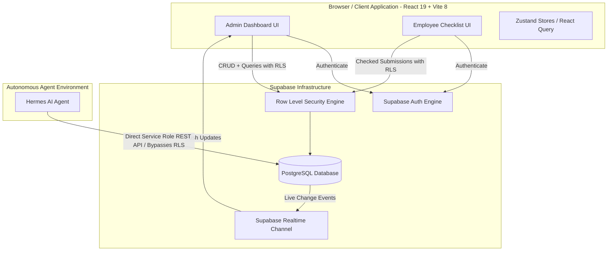
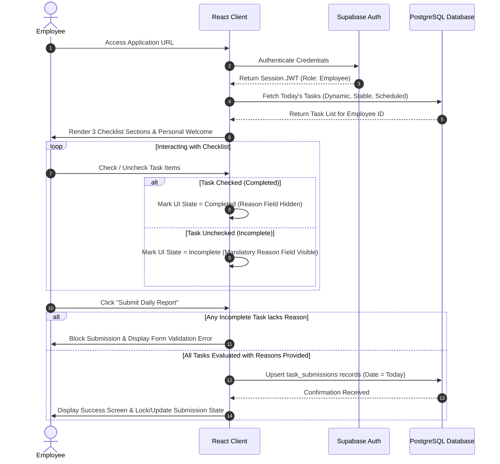
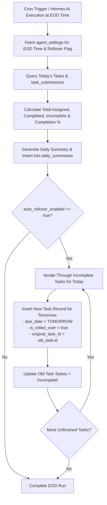
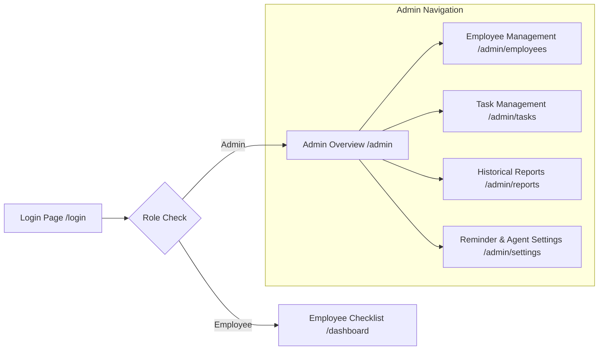

# Product Requirements Document (PRD)

## Project: TaskAgent — Task Management & Admin Dashboard System

---

| Document Attribute | Value |
| :--- | :--- |
| **Document Title** | TaskAgent Product Requirements Document |
| **Version** | 1.0.0 |
| **Status** | Approved / Baseline |
| **Author** | Senior Technical Documentation Team |
| **Target Application** | TaskAgent Web Application & AI Execution Layer |
| **Technology Stack** | React 19, Vite 8, Tailwind CSS v4, shadcn/ui, Bun, Supabase (PostgreSQL + Auth + Realtime + Storage) |
| **Architecture Pattern** | Supabase-Driven Serverless (No Custom Node/Express Backend) |

---

## 1. Executive Summary

**TaskAgent** is an enterprise-grade, serverless task management and administration dashboard engineered to streamline operational accountability between managers (Admins) and field/office staff (Employees). 

By uniting structured daily task execution with an autonomous background AI agent (**Hermes**), TaskAgent automates task lifecycle governance—ranging from daily checklist enforcement and reason collection for incomplete tasks to scheduled reminders, end-of-day summary generation, and task rollover execution.

The frontend is built on **React 19**, **Vite 8**, **Tailwind CSS v4**, **shadcn/ui**, and executed via **Bun**. Backend capabilities rely entirely on **Supabase** (PostgreSQL, Supabase Auth, Row Level Security, and Realtime Subscriptions). **Hermes AI Agent** interacts directly with Supabase using the service role credentials, enabling frictionless task scheduling, intelligent rollover, and automated historical reporting.

---

## 2. Problem Statement & Core Objectives

### 2.1 Problem Statement
Modern businesses and operations teams suffer from significant friction in daily task execution and accountability tracking:
1. **Lack of Centralized Execution Tracking**: Operational tasks are scattered across chat apps, spreadsheets, or verbal instructions, leading to missed assignments and zero historical auditability.
2. **High Administrative Overhead**: Managers spend excessive time manually reminding employees, checking task completion, and manually rescheduling unfinished tasks for the next business day.
3. **Missing Context for Non-Completion**: When tasks remain incomplete, managers lack structured insight into *why* work was not delivered, requiring follow-up communications.
4. **Lack of Automated AI Operations**: Traditional task management software lacks autonomous background agents capable of summarizing performance, enforcing end-of-day policies, and handling dynamic rollover.

### 2.2 Core Objectives
- **Zero-Backend Architecture**: Rely 100% on Supabase primitives (Auth, RLS, RPC, Realtime) to minimize operational maintenance and server overhead.
- **Structured Employee Checklist**: Provide employees with a distraction-free, 3-section daily checklist (Today's Tasks, Daily Works, Scheduled Items) requiring reason submission for incomplete items.
- **Autonomous AI Operations**: Enable **Hermes AI** to inspect, remind, rollover, and aggregate task statistics using direct database integration via Supabase REST API and service keys.
- **Real-Time Visibility**: Deliver live updates to Admin dashboards using Supabase Realtime subscriptions (`postgres_changes`).
- **Comprehensive Auditability**: Store historical `task_submissions` and daily summaries for analytical export (CSV/JSON).

---

## 3. Target Users & System Roles

The system strictly supports two human user roles authenticated via Supabase Auth, plus one system service role reserved for the Hermes AI Agent.

| Role | Access Level | Primary Objectives & Capabilities | Authentication Method |
| :--- | :--- | :--- | :--- |
| **Admin (Manager)** | Full System Administration | • Provision and manage employee user accounts.<br>• Full CRUD on all task categories and employee schedules.<br>• Real-time monitoring of daily submission completion rates.<br>• Filter and export historical task data.<br>• Configure AI reminder frequencies and End-Of-Day (EOD) cutoff times. | Supabase Auth (Email + Password), JWT containing `role: admin` app metadata or profile claim. |
| **Employee (Worker)** | Restricted Operational Access | • View personalized daily tasks categorized by type.<br>• Tick/untick items with real-time UI state persistence.<br>• Submit mandatory textual reasons for any uncompleted tasks.<br>• Submit consolidated daily report once per business day.<br>• View rolled-over items from previous business days. | Supabase Auth (Email + Password provisioned by Admin; no self-registration). |
| **AI Agent (Hermes)** | Service Role Full System Access | • Perform direct CRUD across all database tables bypassing RLS.<br>• Dispatch automated interval reminders for incomplete items.<br>• Execute EOD sweep, calculate completion metrics, and draft daily summaries.<br>• Process task rollovers with appropriate badging.<br>• Generate clean CSV/JSON exports for external reporting. | Supabase `service_role` secret key via HTTPS REST / PostgREST endpoints. |

---

## 4. System Architecture & High-Level Design

### 4.1 Serverless Architecture Diagram



### 4.2 Key Architectural Components
1. **Frontend Application**: SPA hosted statically, built with React 19, Vite 8, Tailwind CSS v4, Lucide icons, and shadcn/ui primitives.
2. **State Management & Data Fetching**:
   - **TanStack Query (React Query v5)** for server state fetching, mutation handling, cache invalidation, and optimistic UI updates.
   - **Zustand** for transient client states (Theme mode, Active filters, Drawer states).
3. **Data Layer & Security**:
   - **PostgreSQL Database** hosted on Supabase with strict Row Level Security (RLS) rules enforced for client queries.
   - **Supabase Realtime** broadcasting `INSERT`, `UPDATE`, and `DELETE` events from the `task_submissions` and `tasks` tables directly to the Admin dashboard.
4. **Hermes AI Integration**:
   - Out-of-band agent executable running on a scheduled daemon/cron environment or serverless worker.
   - Authorizes requests using Supabase `SUPABASE_SERVICE_ROLE_KEY`.

---

## 5. Database Schema & Security Specification

### 5.1 Enums & Custom Types

```sql
-- Role Enum
CREATE TYPE user_role AS ENUM ('admin', 'employee');

-- Task Category Enum
CREATE TYPE task_category AS ENUM ('dynamic', 'stable', 'scheduled');

-- Task Status Enum
CREATE TYPE task_status AS ENUM ('pending', 'completed', 'incomplete', 'cancelled');

-- Submission Status Enum
CREATE TYPE submission_status AS ENUM ('completed', 'incomplete');
```

### 5.2 Database Tables

#### 1. `profiles`
Extends `auth.users` with application-specific metadata.

```sql
CREATE TABLE public.profiles (
    id UUID PRIMARY KEY REFERENCES auth.users(id) ON DELETE CASCADE,
    email TEXT NOT NULL UNIQUE,
    full_name TEXT NOT NULL,
    role user_role NOT NULL DEFAULT 'employee',
    is_active BOOLEAN NOT NULL DEFAULT true,
    created_at TIMESTAMPTZ NOT NULL DEFAULT timezone('utc'::text, now()),
    updated_at TIMESTAMPTZ NOT NULL DEFAULT timezone('utc'::text, now())
);
```

#### 2. `tasks`
Stores task definitions across all three categories.

```sql
CREATE TABLE public.tasks (
    id UUID PRIMARY KEY DEFAULT gen_random_uuid(),
    title TEXT NOT NULL,
    description TEXT,
    category task_category NOT NULL DEFAULT 'dynamic',
    assigned_to UUID REFERENCES public.profiles(id) ON DELETE SET NULL, -- NULL means assigned to ALL employees
    is_global BOOLEAN NOT NULL DEFAULT false, -- True if assigned to all employees
    scheduled_at TIMESTAMPTZ, -- Populated for 'scheduled' category
    due_date DATE NOT NULL DEFAULT CURRENT_DATE,
    is_rolled_over BOOLEAN NOT NULL DEFAULT false,
    original_task_id UUID REFERENCES public.tasks(id) ON DELETE SET NULL,
    status task_status NOT NULL DEFAULT 'pending',
    created_by UUID REFERENCES public.profiles(id) ON DELETE SET NULL,
    created_at TIMESTAMPTZ NOT NULL DEFAULT timezone('utc'::text, now()),
    updated_at TIMESTAMPTZ NOT NULL DEFAULT timezone('utc'::text, now())
);
```

#### 3. `task_submissions`
Records individual employee completion or non-completion logs per task per day.

```sql
CREATE TABLE public.task_submissions (
    id UUID PRIMARY KEY DEFAULT gen_random_uuid(),
    task_id UUID NOT NULL REFERENCES public.tasks(id) ON DELETE CASCADE,
    employee_id UUID NOT NULL REFERENCES public.profiles(id) ON DELETE CASCADE,
    submission_date DATE NOT NULL DEFAULT CURRENT_DATE,
    status submission_status NOT NULL,
    reason_for_incomplete TEXT, -- Mandatory if status is 'incomplete'
    submitted_at TIMESTAMPTZ NOT NULL DEFAULT timezone('utc'::text, now()),
    UNIQUE(task_id, employee_id, submission_date)
);
```

#### 4. `agent_settings`
System configuration table managed by Admin or Hermes AI.

```sql
CREATE TABLE public.agent_settings (
    id UUID PRIMARY KEY DEFAULT gen_random_uuid(),
    reminder_interval_hours INT NOT NULL DEFAULT 2, -- e.g., every 1, 2, or 4 hours
    end_of_day_time TIME NOT NULL DEFAULT '18:00:00', -- EOD cutoff (e.g., 6 PM)
    auto_rollover_enabled BOOLEAN NOT NULL DEFAULT true,
    created_at TIMESTAMPTZ NOT NULL DEFAULT timezone('utc'::text, now()),
    updated_at TIMESTAMPTZ NOT NULL DEFAULT timezone('utc'::text, now())
);
```

#### 5. `daily_summaries`
Stores end-of-day processing outcomes generated by Hermes AI.

```sql
CREATE TABLE public.daily_summaries (
    id UUID PRIMARY KEY DEFAULT gen_random_uuid(),
    summary_date DATE NOT NULL UNIQUE,
    total_employees INT NOT NULL DEFAULT 0,
    total_tasks_assigned INT NOT NULL DEFAULT 0,
    total_completed INT NOT NULL DEFAULT 0,
    total_incomplete INT NOT NULL DEFAULT 0,
    completion_rate NUMERIC(5,2) NOT NULL DEFAULT 0.00,
    ai_summary_text TEXT NOT NULL,
    generated_at TIMESTAMPTZ NOT NULL DEFAULT timezone('utc'::text, now())
);
```

### 5.3 Database Indexing Strategy
- `CREATE INDEX idx_tasks_assigned_due ON public.tasks (assigned_to, due_date, status);`
- `CREATE INDEX idx_tasks_category ON public.tasks (category);`
- `CREATE INDEX idx_submissions_emp_date ON public.task_submissions (employee_id, submission_date);`
- `CREATE INDEX idx_submissions_date ON public.task_submissions (submission_date);`

### 5.4 Row Level Security (RLS) Rules

```sql
-- Enable RLS on all tables
ALTER TABLE public.profiles ENABLE ROW LEVEL SECURITY;
ALTER TABLE public.tasks ENABLE ROW LEVEL SECURITY;
ALTER TABLE public.task_submissions ENABLE ROW LEVEL SECURITY;
ALTER TABLE public.agent_settings ENABLE ROW LEVEL SECURITY;
ALTER TABLE public.daily_summaries ENABLE ROW LEVEL SECURITY;

-- Helper Function: Check if user is admin
CREATE OR REPLACE FUNCTION public.is_admin()
RETURNS BOOLEAN AS $$
BEGIN
  RETURN EXISTS (
    SELECT 1 FROM public.profiles
    WHERE id = auth.uid() AND role = 'admin' AND is_active = true
  );
END;
$$ LANGUAGE plpgsql SECURITY DEFINER;

-- Profiles Policies
CREATE POLICY "Admins have full access to profiles"
    ON public.profiles FOR ALL
    USING (public.is_admin());

CREATE POLICY "Users can view their own profile"
    ON public.profiles FOR SELECT
    USING (auth.uid() = id);

-- Tasks Policies
CREATE POLICY "Admins have full access to tasks"
    ON public.tasks FOR ALL
    USING (public.is_admin());

CREATE POLICY "Employees can view tasks assigned to them or global tasks"
    ON public.tasks FOR SELECT
    USING (
        auth.uid() = assigned_to OR is_global = true
    );

-- Submissions Policies
CREATE POLICY "Admins have full access to task_submissions"
    ON public.task_submissions FOR ALL
    USING (public.is_admin());

CREATE POLICY "Employees can view their own submissions"
    ON public.task_submissions FOR SELECT
    USING (auth.uid() = employee_id);

CREATE POLICY "Employees can create their own submissions"
    ON public.task_submissions FOR INSERT
    WITH CHECK (auth.uid() = employee_id);

CREATE POLICY "Employees can update their own submissions on the current day"
    ON public.task_submissions FOR UPDATE
    USING (auth.uid() = employee_id AND submission_date = CURRENT_DATE);

-- Agent Settings Policies
CREATE POLICY "Admins can view and edit agent_settings"
    ON public.agent_settings FOR ALL
    USING (public.is_admin());

CREATE POLICY "Employees can view agent_settings"
    ON public.agent_settings FOR SELECT
    USING (auth.role() = 'authenticated');

-- Daily Summaries Policies
CREATE POLICY "Authenticated users can view daily_summaries"
    ON public.daily_summaries FOR SELECT
    USING (auth.role() = 'authenticated');
```

> [!NOTE]
> The **Hermes AI Agent** authenticates using the `SUPABASE_SERVICE_ROLE_KEY`, which automatically bypasses Row Level Security policies in Supabase, allowing full system execution without requiring artificial impersonation logic.

---

## 6. Task Categories & Execution Flows

### 6.1 Task Categorization Matrix

| Category | Description | Typical Use Cases | Recurrence / Scheduling |
| :--- | :--- | :--- | :--- |
| **Dynamic Tasks** | Ad-hoc or specific operational assignments assigned to individual staff or all staff. | "Post a feed to Instagram", "Comment on 5 target LinkedIn posts", "Restock storefront display". | Assigned for a specific date; rolls over if incomplete. |
| **Stable Works** | Core daily operational routines that remain constant day after day. | "Check warehouse inventory counts", "Perform morning security checklist", "Open store at 9 AM". | Auto-instantiated daily for assigned roles/employees. |
| **Scheduled Tasks** | Datetime-bound commitments requiring execution at precise timestamps. | "Client discovery call at 3:00 PM", "Submit financial report by 5:00 PM", "Vendor pickup at 11:30 AM". | Tied to a specific `scheduled_at` timestamp. |

---

### 6.2 Employee Daily Checklist Workflow



#### Detailed Lifecycle Steps:
1. **Login & Session Initialization**: Employee opens the web application and authenticates. Self-registration is disabled; credentials are provided by Admin.
2. **Dashboard Initialization**: Client retrieves current user profile and queries tasks where `assigned_to = auth.uid() OR is_global = true` for `due_date = CURRENT_DATE`.
3. **Structured Rendering**: Dashboard groups items into three distinct cards:
   - *Today's Tasks* (Dynamic)
   - *Daily Works* (Stable)
   - *Scheduled Items* (Scheduled with time pills)
4. **Item Evaluation**: Employee toggles checkboxes next to items:
   - Checking an item marks its status as `completed`.
   - Unchecking an item automatically renders a required text area: *"Reason for non-completion"*.
5. **Validation Enforcement**: The "Submit Daily Report" button checks that every item assigned for today is explicitly marked as completed **OR** has a non-empty explanation string.
6. **Batch Submission**: Upon clicking submit, client fires a single atomic batch transaction to insert/upsert records into `task_submissions`.
7. **Historical Logging**: Once submitted, `task_submissions` records are permanently tied to that employee, task ID, and submission timestamp.
8. **Rollover Preparation**: Uncompleted tasks are tagged for potential rollover during Hermes AI's End-Of-Day (EOD) processing run.

---

### 6.3 End-Of-Day (EOD) Processing & Task Rollover Mechanism



---

### 6.4 Automated Reminder Dispatch Lifecycle

Hermes AI executes an interval poll (e.g., every 1 or 2 hours as configured in `agent_settings.reminder_interval_hours`):
1. **Query Unsubmitted Employees**: Identifies active employees who have not yet submitted their `task_submissions` for `CURRENT_DATE`.
2. **Evaluate Cutoff**: If current time is prior to `end_of_day_time`, Hermes triggers notification channels (e.g., webhook, email notification, or system alert table).
3. **Admin Escalation**: If time exceeds `end_of_day_time` and submission is missing, Hermes flags the user status on the Admin live overview board.

---

## 7. Comprehensive User Stories

### 7.1 Admin Persona

#### US-01: Employee Provisioning
- **As an** Admin,
- **I want to** create employee user accounts directly from the admin dashboard with email and initial password,
- **So that** I can onboard team members without allowing public self-registration.
- **Acceptance Criteria**:
  - Admin form validates email format and password strength.
  - Submits account creation request via Supabase Auth Admin API.
  - Automatically inserts matching record into `profiles` table with `role = 'employee'`.
  - Displays success notification with credentials ready to communicate to employee.

#### US-02: Account Management & Deactivation
- **As an** Admin,
- **I want to** edit employee names or deactivate employee accounts,
- **So that** former staff members cannot log in while preserving historical submission logs.
- **Acceptance Criteria**:
  - Toggling `is_active = false` immediately prevents employee login and hides them from active task assignment dropdowns.
  - Historical `task_submissions` associated with deactivated employees remain intact and visible in historical reports.

#### US-03: Dynamic Task Assignment
- **As an** Admin,
- **I want to** create Dynamic tasks and assign them to specific employees or all employees,
- **So that** ad-hoc work is clearly assigned for the current or future dates.
- **Acceptance Criteria**:
  - Modal provides fields: Title, Description, Assigned Employee (dropdown including "All Employees"), Due Date.
  - Setting "All Employees" sets `is_global = true`.
  - Tasks immediately reflect on assigned employees' dashboards.

#### US-04: Stable Works Management
- **As an** Admin,
- **I want to** configure recurring Stable Works that automatically populate daily checklists,
- **So that** standard operational routines do not need to be manually recreated every day.
- **Acceptance Criteria**:
  - Ability to create tasks with category `stable`.
  - Stable works automatically appear on the employee checklist for every active day until deleted or archived by Admin.

#### US-05: Scheduled Task Management
- **As an** Admin,
- **I want to** schedule time-sensitive tasks with a specific datetime timestamp,
- **So that** time-critical assignments are clearly highlighted with time badges.
- **Acceptance Criteria**:
  - Form includes standard date and time picker (`scheduled_at`).
  - Renders with prominent visual clock badges on employee checklist UI.

#### US-06: Real-Time Daily Overview
- **As an** Admin,
- **I want to** view a real-time overview of today's submission status across all employees,
- **So that** I can immediately identify who has submitted their report, who is in progress, and overall completion percentages.
- **Acceptance Criteria**:
  - Live progress cards showing Total Staff, Submitted Count, Pending Count, Overall Completion Rate %.
  - Live table updated instantly via Supabase Realtime subscriptions without manual page refresh.

#### US-07: Historical Reporting & Analytical Filters
- **As an** Admin,
- **I want to** query past submission logs filtered by date range, employee, and task category,
- **So that** I can audit employee performance and examine non-completion reasons.
- **Acceptance Criteria**:
  - Date picker supporting preset ranges (Today, Yesterday, Last 7 Days, Last 30 Days, Custom Range).
  - Multi-select filter for employees and task categories.
  - Displays reason text for any task marked incomplete.

#### US-08: AI Agent & System Configuration
- **As an** Admin,
- **I want to** set reminder intervals and End-Of-Day cutoff times for Hermes AI,
- **So that** automated actions conform to our company's working hours.
- **Acceptance Criteria**:
  - UI inputs for `reminder_interval_hours` (1, 2, 4, 6 hours) and `end_of_day_time` (time input e.g. 18:00).
  - Toggle for `auto_rollover_enabled`.
  - Persists directly into `agent_settings` table.

#### US-09: Monthly Summary Export
- **As an** Admin,
- **I want to** download monthly performance summaries in CSV and JSON formats,
- **So that** data can be ingested into external reporting tools or evaluated by AI pipelines.
- **Acceptance Criteria**:
  - Export modal allows selecting month/year.
  - Generates clean CSV file and formatted JSON array containing task titles, employee names, status, reasons, and completion percentages.

---

### 7.2 Employee Persona

#### US-10: Employee Login
- **As an** Employee,
- **I want to** log into TaskAgent using my assigned email and password,
- **So that** I can access my personalized work checklist.
- **Acceptance Criteria**:
  - Simple login form with error handling for invalid credentials.
  - Redirects to `/dashboard` upon successful authentication.
  - Prevents access to `/admin/*` routes.

#### US-11: Personalized Checklist View
- **As an** Employee,
- **I want to** view my daily tasks categorized into "Today's Tasks", "Daily Works", and "Scheduled Items",
- **So that** I can easily prioritize my day.
- **Acceptance Criteria**:
  - Greeting displays employee's full name and current date (e.g., *"Welcome back, Alex - Wednesday, Aug 5"*).
  - Clear 3-section layout.
  - Scheduled items explicitly display formatted scheduled times (e.g., *"3:00 PM"*).

#### US-12: Task Completion & Reason Input
- **As an** Employee,
- **I want to** tick tasks I have completed and enter reasons for any tasks I could not complete,
- **So that** my daily progress is accurately reported.
- **Acceptance Criteria**:
  - Checkbox toggles item completed state instantly.
  - Unchecking an item reveals a mandatory textarea: *"Provide reason for non-completion"*.
  - Inline validation warns if text is missing before submission.

#### US-13: Daily Report Submission
- **As an** Employee,
- **I want to** click "Submit Daily Report" to finalize my day's checklist,
- **So that** my manager receives my completed log.
- **Acceptance Criteria**:
  - Submits batch payload to `task_submissions`.
  - UI transitions to a "Report Submitted" confirmation state showing completion summary.
  - Employee can update their submission until the EOD cutoff if adjustments are needed.

#### US-14: Rolled-Over Task Visibility
- **As an** Employee,
- **I want to** see tasks that were rolled over from yesterday clearly marked on my checklist,
- **So that** I know which overdue items require immediate attention.
- **Acceptance Criteria**:
  - Rolled-over tasks feature a distinct visual badge: `[Rolled Over]`.
  - Mouseover / tooltip indicates original due date.

---

### 7.3 Hermes AI Agent Persona

#### US-15: Service Role System Connection
- **As the** Hermes AI Agent,
- **I want to** connect to Supabase via the REST API using the service role key,
- **So that** I can read and write to all tables without RLS restriction.
- **Acceptance Criteria**:
  - Agent authenticates using HTTP headers `apikey: SERVICE_ROLE_KEY` and `Authorization: Bearer SERVICE_ROLE_KEY`.
  - Verified full access to `profiles`, `tasks`, `task_submissions`, `agent_settings`, and `daily_summaries`.

#### US-16: Automated Reminder Processing
- **As the** Hermes AI Agent,
- **I want to** inspect active pending submissions based on `agent_settings.reminder_interval_hours`,
- **So that** I can trigger automated reminders to employees with pending tasks.
- **Acceptance Criteria**:
  - Queries active employees lacking a `task_submissions` record for `CURRENT_DATE`.
  - Dispatches reminder triggers for non-submitted users prior to EOD time.

#### US-17: End-Of-Day Summary Generation
- **As the** Hermes AI Agent,
- **I want to** execute an EOD check at `end_of_day_time`,
- **So that** I can compute daily statistics and generate a textual AI summary.
- **Acceptance Criteria**:
  - Calculates total assigned tasks, completed count, incomplete count, overall completion rate.
  - Inserts summary record into `daily_summaries` table.

#### US-18: Automated Task Rollover Execution
- **As the** Hermes AI Agent,
- **I want to** duplicate incomplete tasks into tomorrow's schedule with `is_rolled_over = true`,
- **So that** uncompleted work is not lost and carries forward automatically.
- **Acceptance Criteria**:
  - Identifies tasks with status `pending` or marked `incomplete` in `task_submissions` for today.
  - Inserts clone into `tasks` table with `due_date = CURRENT_DATE + 1`, `is_rolled_over = true`, and `original_task_id`.

---

## 8. Feature Requirements Matrix & Priority

| ID | Feature Name | Description | User Role | Priority |
| :--- | :--- | :--- | :--- | :--- |
| **FR-01** | Supabase Auth Integration | Email + Password authentication for Admin and Employee accounts. | All | **P0** |
| **FR-02** | Role-Based Access Control | Strict RLS policies separating Admin capabilities from Employee views. | All | **P0** |
| **FR-03** | 3-Section Employee Checklist | Render Today's Tasks, Daily Works, and Scheduled Items. | Employee | **P0** |
| **FR-04** | Completion & Reason Input | Tick/untick tasks with required reason textarea for uncompleted tasks. | Employee | **P0** |
| **FR-05** | Daily Report Submission | Atomic batch write of `task_submissions` records for current date. | Employee | **P0** |
| **FR-06** | Task CRUD (Admin) | Create, edit, delete, and view tasks across all 3 categories. | Admin | **P0** |
| **FR-07** | Employee Account Provisioning | Admin interface to create new employee profiles via Supabase Auth. | Admin | **P0** |
| **FR-08** | Real-Time Admin Overview | Live dashboard with submission stats updated via Supabase Realtime. | Admin | **P0** |
| **FR-09** | Task Rollover Engine | Hermes AI auto-creates next-day copies of uncompleted tasks with badge. | AI Agent | **P0** |
| **FR-10** | End-of-Day Summary Generator | Hermes AI generates daily metrics and text summary at cutoff time. | AI Agent | **P1** |
| **FR-11** | Historical Submissions Report | Search, filter, and view historical task submissions by date/employee. | Admin | **P1** |
| **FR-12** | Reminder Settings Configuration | Form to update reminder intervals and EOD time in `agent_settings`. | Admin | **P1** |
| **FR-13** | CSV / JSON Monthly Export | Export monthly performance logs for offline analysis or AI pipelines. | Admin | **P1** |
| **FR-14** | Dark Mode / Light Mode | System-wide theme switcher using Zustand and Tailwind CSS v4 variables. | All | **P1** |
| **FR-15** | Rolled-Over Task Management | Admin capability to cancel or dismiss rolled-over tasks. | Admin | **P2** |
| **FR-16** | Responsive Mobile Layout | Mobile-first drawer navigation and touch-optimized checklist checkboxes. | All | **P2** |

---

## 9. Detailed UI & Screen Specifications



### 9.1 Public / Authentication Screen (`/login`)
- **Visual Design**: Centered card layout with clean brand logo, dark/light theme switch in top corner.
- **Components**: Email input, Password input, "Sign In" primary button, inline error banner for invalid credentials.
- **Behavior**: Authenticates against Supabase Auth. Upon resolution, inspects user role in `profiles`:
  - `role == 'admin'` $\rightarrow$ Redirect to `/admin`
  - `role == 'employee'` $\rightarrow$ Redirect to `/dashboard`

---

### 9.2 Employee Checklist Dashboard (`/dashboard`)
- **Header Section**:
  - User avatar, employee full name, current day/date display.
  - Overall progress bar showing percentage of checked items for today.
- **Section 1: Today's Tasks (Dynamic)**:
  - List of dynamic tasks assigned for today.
  - Checkbox, task title, description dropdown toggle.
  - Badges: `[Dynamic]`, `[Rolled Over]` (if applicable).
- **Section 2: Daily Works (Stable)**:
  - Recurring stable items.
  - Badges: `[Stable Routine]`.
- **Section 3: Scheduled Items (Scheduled)**:
  - Datetime-bound items.
  - Badges: `[Scheduled: 3:00 PM]`.
- **Reason Field**:
  - Appears automatically beneath any unchecked item upon unchecking.
  - Textarea with placeholder: *"Please explain why this task could not be completed..."*.
- **Footer Bar**:
  - Sticky bottom action container containing "Submit Daily Report" button and submission status badge.

---

### 9.3 Admin Operations Dashboard

#### 1. Real-Time Overview (`/admin`)
- **Metrics Cards Row**:
  - *Total Active Employees*
  - *Submitted Reports Today* (e.g. `8 / 10`)
  - *Total Completion Rate* (e.g. `88.5%`)
  - *Pending Rolled-Over Items*
- **Live Submission Status Table**:
  - Columns: Employee Name, Status (`Submitted` [Green], `In Progress` [Yellow], `Not Started` [Red]), Total Tasks, Completed, Incomplete, Last Updated.
  - Powered by Supabase Realtime (`postgres_changes` listener on `task_submissions`).

#### 2. Employee Management (`/admin/employees`)
- **Actions Bar**: "Add New Employee" trigger button opening side sheet modal.
- **Employee Table**: Avatar, Full Name, Email, Role, Status (`Active` / `Inactive`), Action buttons (Edit Name, Reset Password, Deactivate).
- **Creation Drawer Form**: Full Name, Email, Password, Role select dropdown.

#### 3. Task Management (`/admin/tasks`)
- **Tabbed View**: `All Tasks` | `Dynamic` | `Stable` | `Scheduled` | `Rolled Over`.
- **Creation Modal**:
  - Category selector (`Dynamic`, `Stable`, `Scheduled`).
  - Title & Description fields.
  - Assignment dropdown (`All Employees` or specific employee selection).
  - Date & Scheduled Datetime pickers.
- **Task Table**: Title, Category badge, Assigned To, Due Date, Status, Quick Actions (Edit, Delete, Cancel Rollover).

#### 4. Historical Reports & Exports (`/admin/reports`)
- **Filter Bar**: Date Range Picker (Presets + Custom Range), Employee Multi-Select, Category Multi-Select, Export Format Selector (CSV / JSON).
- **Submissions Audit Table**: Date, Employee, Task Name, Category, Submission Status, Reason for Non-Completion (expandable drawer).
- **Export Trigger**: Downloads compiled report matching current filter constraints.

#### 5. Reminder & Agent Settings (`/admin/settings`)
- **Settings Card**:
  - `Reminder Interval`: Dropdown (`1 hour`, `2 hours`, `4 hours`).
  - `End Of Day Cutoff Time`: Time picker input (`18:00`).
  - `Enable Auto Rollover`: Toggle switch.
  - `Save Settings` button updates `agent_settings` table.

---

## 10. Hermes AI Agent Integration Specification

### 10.1 Connection & Security Protocol
Hermes AI functions as an autonomous actor outside the browser. It connects directly to Supabase via HTTP REST endpoints using PostgREST syntax.

```http
GET /rest/v1/tasks?status=eq.pending&due_date=eq.2026-08-05 HTTP/1.1
Host: <your-supabase-project-id>.supabase.co
apikey: <SUPABASE_SERVICE_ROLE_KEY>
Authorization: Bearer <SUPABASE_SERVICE_ROLE_KEY>
Content-Type: application/json
```

> [!WARNING]
> The `SUPABASE_SERVICE_ROLE_KEY` bypasses all Row Level Security. It must strictly reside within Hermes AI's server-side environment variables and NEVER be bundled into the React client application.

### 10.2 Hermes Task Matrix & Cron Jobs

```mermaid
chronicle
    title Hermes AI Daily Operational Cycle
    08:00 : Hermes sweeps active tasks and verifies daily assignments
    10:00 : Interval Reminder Check #1 (Flags unsubmitted workers)
    12:00 : Interval Reminder Check #2
    14:00 : Interval Reminder Check #3
    16:00 : Interval Reminder Check #4
    18:00 : EOD Cutoff Reached -> Compiles Daily Statistics -> Writes daily_summaries -> Executes Task Rollover
```

1. **Interval Reminders**: Checks missing `task_submissions` records against active employees.
2. **EOD Analytics Aggregation**: Calculates completion percentages and writes structured insights to `daily_summaries`.
3. **Rollover Execution**: Executes a batch query:
   ```sql
   -- Conceptual SQL executed by Hermes AI at EOD cutoff
   INSERT INTO public.tasks (title, description, category, assigned_to, is_global, scheduled_at, due_date, is_rolled_over, original_task_id, status, created_by)
   SELECT 
       t.title,
       t.description,
       t.category,
       t.assigned_to,
       t.is_global,
       t.scheduled_at,
       CURRENT_DATE + INTERVAL '1 day',
       true,
       t.id,
       'pending',
       t.created_by
   FROM public.tasks t
   LEFT JOIN public.task_submissions ts ON t.id = ts.task_id AND ts.submission_date = CURRENT_DATE
   WHERE t.due_date = CURRENT_DATE 
     AND (ts.status IS NULL OR ts.status = 'incomplete')
     AND t.status != 'cancelled';
   ```

---

## 11. Non-Functional Requirements (NFRs)

### 11.1 Performance & Responsiveness
- **Page Load Time**: Initial Page Load Time (FCP) must be under **1.5 seconds** over standard 4G networks.
- **Client Latency**: UI checkbox toggles and input state updates must respond in $< 50\text{ ms}$.
- **Optimistic UI Updates**: Checklist state updates immediately on the client while syncing asynchronously with Supabase.

### 11.2 Design & Theme System
- **Responsive Layout**: Full layout adaptation for Desktop ($\ge 1024\text{px}$), Tablet ($768\text{px} - 1023\text{px}$), and Mobile ($< 768\text{px}$).
- **Color System**: Tailwind CSS v4 OKLCH color variables configured in `src/index.css` supporting smooth Dark/Light mode transitions.
- **Component Primitives**: Accessible UI built with shadcn/ui components and Lucide icons.

### 11.3 Real-Time Infrastructure
- **Supabase Realtime**: Live updates enabled for `task_submissions` using `supabase.channel('admin-overview')` to ensure Admin dashboard reflects submissions within $< 500\text{ ms}$ of employee submission.

### 11.4 Accessibility & Usability (WCAG 2.1 AA)
- Full keyboard navigation for checklist toggling (`Tab`, `Space`, `Enter`).
- Color contrast ratios $\ge 4.5:1$ for normal text and $\ge 3:1$ for UI badges.
- `aria-checked`, `aria-expanded`, and descriptive label bindings across all form components.

### 11.5 Search Engine Optimization (SEO)
- Dynamic document titles and meta descriptions applied to public and authentication pages (`index.html`, React Helmet / router titles).

---

## 12. Success Metrics & Key Performance Indicators (KPIs)

| Metric | Target Goal | Measurement Frequency | Method of Verification |
| :--- | :--- | :--- | :--- |
| **Daily Submission Rate** | $> 95\%$ of active employees | Daily at EOD Cutoff | Query `task_submissions` vs active `profiles`. |
| **Reason Compliance** | $100\%$ for incomplete items | Continuous | SQL constraint validation on `reason_for_incomplete`. |
| **Average Task Completion Rate** | $> 85\%$ overall completion | Weekly / Monthly | Calculated in `daily_summaries.completion_rate`. |
| **Admin Time Saved** | $> 70\%$ reduction in manual follow-ups | Monthly | Operational audit of manager manual reminder time. |
| **Realtime Sync Latency** | $< 500\text{ ms}$ broadcast delivery | Continuous | Web performance monitoring of Supabase socket messages. |

---

## 13. Out of Scope

The following features are explicitly **out of scope** for TaskAgent Version 1.0:
1. **Public Self-Registration**: Workers cannot sign up independently; all accounts are provisioned exclusively by Admins.
2. **Custom Backend Services**: No standalone Node.js, Express, or Python API server. All client operations interact directly with Supabase.
3. **In-App Direct Chat**: Communications regarding non-completion reasons are captured strictly through text explanations in task submissions.
4. **Third-Party Payroll / HR Integration**: Integrations with external HR software (e.g. Workday, BambooHR) are deferred to future releases.

---

## 14. Document Revision & Sign-Off History

| Revision | Date | Description | Author |
| :--- | :--- | :--- | :--- |
| `v1.0.0` | 2026-08-05 | Initial Comprehensive Product Requirements Document baseline release. | Senior Technical Documentation Team |

---
