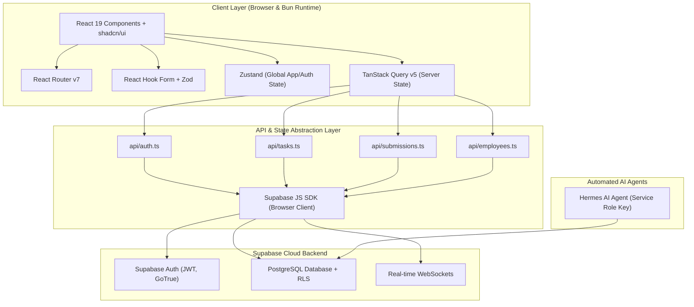
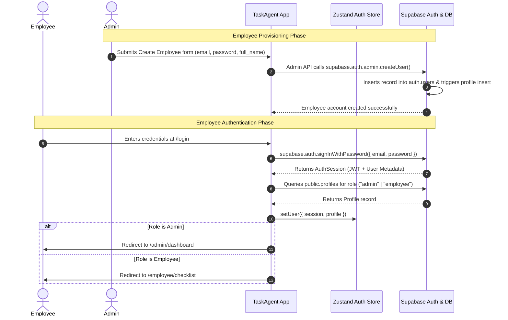

# TaskAgent — Technical Specification & Architecture Document

## Executive Overview
**TaskAgent** is an enterprise-grade task management and administration dashboard built to streamline operational task assignment, daily employee checklist submissions, automated AI processing, and real-time administrative oversight.

The application leverages a high-performance modern web stack featuring **React 19**, **Vite 8**, **TypeScript**, **Tailwind CSS v4**, **shadcn/ui**, **React Router v7**, **Zustand**, **TanStack Query v5**, **React Hook Form**, **Zod**, and **Supabase**. The runtime and package management are powered by **Bun**.

---

## Technical Stack & Architecture

### System Architecture Overview



### Core Tech Stack Matrix

| Layer | Framework / Library | Version / Tooling | Purpose |
| :--- | :--- | :--- | :--- |
| **Runtime & PM** | Bun | `^1.1.0` | Ultra-fast JavaScript runtime & package manager |
| **Frontend Framework** | React | `^19.0.0` | UI rendering with concurrent features and server components readiness |
| **Build System** | Vite | `^8.0.0` | Hot Module Replacement (HMR) and production bundler |
| **Language** | TypeScript | `^5.6.0` | Strict type safety and DX |
| **Styling** | Tailwind CSS | `v4.0` | Engine-first utility CSS with native CSS variables |
| **UI Components** | shadcn/ui + Radix Primitives | Latest | Accessible, customizable headless components |
| **Routing** | React Router | `v7.0` | Data-aware client routing and layout nesting |
| **Server State** | TanStack Query (React Query) | `v5.0` | Cache management, optimistic UI updates, polling, auto-refetch |
| **Client State** | Zustand | `v5.0` | Lightweight store for auth session, active theme, and UI state |
| **Form Management** | React Hook Form | `v7.0` | Uncontrolled/controlled form performance with state binding |
| **Validation** | Zod | `v3.0` | Schema validation and automatic TypeScript type inference |
| **Backend / DB** | Supabase | Cloud (`@supabase/supabase-js v2`) | Auth, PostgreSQL DB, Real-Time subscriptions |

---

## 1. Supabase Configuration

### Project Setup Steps

1. **Create Supabase Project**
   - Log in to the [Supabase Dashboard](https://database.new).
   - Create a new project named `taskagent-prod`.
   - Select the target geographic region closest to the primary user base.
   - Record the generated database password safely.

2. **Database Provisioning & Migration Execution**
   - Navigate to the SQL Editor in Supabase.
   - Execute the schema migration script (`docs/SCHEMA.md`) containing tables (`profiles`, `tasks`, `task_submissions`, `audit_logs`), Row Level Security (RLS) policies, triggers, and foreign keys.

3. **Authentication Configuration**
   - Enable **Email / Password** provider under **Authentication -> Providers**.
   - Disable self-service email signup (`Enable Signups: OFF`) to ensure only administrators can provision employee accounts via the admin panel.
   - Set Site URL to `http://localhost:5173` for development and production domain for deployment.

4. **Real-time Subscriptions Setup**
   - Under **Database -> Replication**, enable real-time replication for the tables `tasks` and `task_submissions`.

### Environment Variables Matrix

Create a `.env` file in the root directory (and `.env.example` committed to git):

```env
# Client-side Public Variables (Vite exposed to Browser)
VITE_SUPABASE_URL=https://<your-project-ref>.supabase.co
VITE_SUPABASE_ANON_KEY=eyJhbGciOiJIUzI1NiIsInR5cCI6IkpXVCJ9...

# Server / Agent Environment Variables (STRICTLY PRIVATE - NEVER EXPOSED TO FRONTEND)
SUPABASE_SERVICE_ROLE_KEY=eyJhbGciOiJIUzI1NiIsInR5cCI6IkpXVCJ9...
```

> [!CAUTION]
> **Security Requirement**: `SUPABASE_SERVICE_ROLE_KEY` bypasses all Row Level Security (RLS) policies. It must **only** be stored in secure backend environments or used by the **Hermes AI Agent**. It MUST NOT be prefixed with `VITE_` and MUST NOT be included in browser bundles.

### Hermes AI Agent Key Access Strategy
- The Hermes AI agent runs as an isolated server process (via Bun runtime script or automated task queue).
- Hermes initializes its own Supabase client using `SUPABASE_SERVICE_ROLE_KEY`:
  ```typescript
  import { createClient } from '@supabase/supabase-js';

  export const hermesSupabaseClient = createClient(
    process.env.VITE_SUPABASE_URL!,
    process.env.SUPABASE_SERVICE_ROLE_KEY!,
    {
      auth: {
        persistSession: false,
        autoRefreshToken: false,
      },
    }
  );
  ```

---

## 2. Authentication Specification

### Auth Flow & Role-Based Access Control (RBAC)

TaskAgent supports two user roles: `admin` and `employee`.



### Session Management & Storage
- **JWT Storage**: Managed automatically by `@supabase/supabase-js` using standard browser `localStorage`.
- **Token Auto-Refresh**: Supabase client automatically refreshes access tokens prior to expiration.
- **State Synchronization**: `supabase.auth.onAuthStateChange` listener updates `useAuthStore` in real-time when tokens refresh, sign out, or expire.

### Protected Routing Logic (`ProtectedRoute` Component)
The `ProtectedRoute` wrapper component validates authentication status and required roles before rendering child routes:

```typescript
// src/components/auth/ProtectedRoute.tsx
import React from 'react';
import { Navigate, Outlet, useLocation } from 'react-router-v7';
import { useAuthStore } from '@/stores/useAuthStore';

interface ProtectedRouteProps {
  allowedRoles?: Array<'admin' | 'employee'>;
}

export const ProtectedRoute: React.FC<ProtectedRouteProps> = ({ allowedRoles }) => {
  const { isAuthenticated, isLoading, role } = useAuthStore();
  const location = useLocation();

  if (isLoading) {
    return <div className="flex h-screen w-screen items-center justify-center">Loading session...</div>;
  }

  if (!isAuthenticated) {
    return <Navigate to="/login" state={{ from: location }} replace />;
  }

  if (allowedRoles && role && !allowedRoles.includes(role)) {
    // Redirect role mismatch to appropriate portal
    const fallbackPath = role === 'admin' ? '/admin/dashboard' : '/employee/checklist';
    return <Navigate to={fallbackPath} replace />;
  }

  return <Outlet />;
};
```

---

## 3. API Layer Specification

All API modules export clean, strongly-typed asynchronous functions interfacing with Supabase client (`src/lib/supabase.ts`).

### Supabase Client Initialization (`src/lib/supabase.ts`)

```typescript
import { createClient } from '@supabase/supabase-js';
import type { Database } from '@/types/supabase';

const supabaseUrl = import.meta.env.VITE_SUPABASE_URL;
const supabaseAnonKey = import.meta.env.VITE_SUPABASE_ANON_KEY;

if (!supabaseUrl || !supabaseAnonKey) {
  throw new Error('Missing VITE_SUPABASE_URL or VITE_SUPABASE_ANON_KEY environment variables.');
}

export const supabase = createClient<Database>(supabaseUrl, supabaseAnonKey);
```

---

### Auth API (`src/api/auth.ts`)

```typescript
import { supabase } from '@/lib/supabase';
import type { AuthResponse, Session, AuthChangeEvent } from '@supabase/supabase-js';
import type { LoginInput } from '@/schemas/auth.schema';

export const authApi = {
  /**
   * Authenticate user with email and password
   */
  async signIn(credentials: LoginInput): Promise<AuthResponse['data']> {
    const { data, error } = await supabase.auth.signInWithPassword({
      email: credentials.email,
      password: credentials.password,
    });
    if (error) throw new Error(error.message);
    return data;
  },

  /**
   * Terminate current user session
   */
  async signOut(): Promise<void> {
    const { error } = await supabase.auth.signOut();
    if (error) throw new Error(error.message);
  },

  /**
   * Retrieve active session from Supabase SDK memory/storage
   */
  async getSession(): Promise<Session | null> {
    const { data, error } = await supabase.auth.getSession();
    if (error) throw new Error(error.message);
    return data.session;
  },

  /**
   * Subscribe to Supabase auth state change events
   */
  onAuthStateChange(callback: (event: AuthChangeEvent, session: Session | null) => void) {
    return supabase.auth.onAuthStateChange(callback);
  },
};
```

---

### Tasks API (`src/api/tasks.ts`)

```typescript
import { supabase } from '@/lib/supabase';
import type { Task, TaskInsert, TaskUpdate, TaskFilterParams } from '@/types/domain';

export const tasksApi = {
  /**
   * Retrieve all tasks with optional category, priority, or status filtering
   */
  async getTasks(filters?: TaskFilterParams): Promise<Task[]> {
    let query = supabase.from('tasks').select('*, assigned_user:profiles!assigned_to(id, full_name, email)');

    if (filters?.category) {
      query = query.eq('category', filters.category);
    }
    if (filters?.priority) {
      query = query.eq('priority', filters.priority);
    }
    if (filters?.is_active !== undefined) {
      query = query.eq('is_active', filters.is_active);
    }
    if (filters?.search) {
      query = query.ilike('title', `%${filters.search}%`);
    }

    const { data, error } = await query.order('created_at', { ascending: false });
    if (error) throw new Error(error.message);
    return data as Task[];
  },

  /**
   * Retrieve tasks assigned to a specific employee for a target date
   */
  async getTasksByEmployee(employeeId: string, date?: string): Promise<Task[]> {
    let query = supabase
      .from('tasks')
      .select('*')
      .eq('assigned_to', employeeId)
      .eq('is_active', true);

    if (date) {
      // Filter tasks active on or scheduled for the target date
      query = query.or(`scheduled_at.eq.${date},is_recurring.eq.true`);
    }

    const { data, error } = await query.order('scheduled_at', { ascending: true });
    if (error) throw new Error(error.message);
    return data as Task[];
  },

  /**
   * Create a new task definition
   */
  async createTask(task: TaskInsert): Promise<Task> {
    const { data, error } = await supabase
      .from('tasks')
      .insert(task)
      .select()
      .single();

    if (error) throw new Error(error.message);
    return data as Task;
  },

  /**
   * Update an existing task record
   */
  async updateTask(id: string, updates: TaskUpdate): Promise<Task> {
    const { data, error } = await supabase
      .from('tasks')
      .update(updates)
      .eq('id', id)
      .select()
      .single();

    if (error) throw new Error(error.message);
    return data as Task;
  },

  /**
   * Soft-delete or hard-delete a task
   */
  async deleteTask(id: string): Promise<void> {
    const { error } = await supabase.from('tasks').delete().eq('id', id);
    if (error) throw new Error(error.message);
  },
};
```

---

### Submissions API (`src/api/submissions.ts`)

```typescript
import { supabase } from '@/lib/supabase';
import type { TaskSubmission, TaskSubmissionUpsert, SubmissionFilterParams } from '@/types/domain';

export const submissionsApi = {
  /**
   * Retrieve task submissions with detailed joins for task & employee profiles
   */
  async getSubmissions(filters?: SubmissionFilterParams): Promise<TaskSubmission[]> {
    let query = supabase
      .from('task_submissions')
      .select(`
        *,
        task:tasks(*),
        employee:profiles!employee_id(id, full_name, email)
      `);

    if (filters?.employeeId) {
      query = query.eq('employee_id', filters.employeeId);
    }
    if (filters?.submission_date) {
      query = query.eq('submission_date', filters.submission_date);
    }
    if (filters?.is_completed !== undefined) {
      query = query.eq('is_completed', filters.is_completed);
    }

    const { data, error } = await query.order('created_at', { ascending: false });
    if (error) throw new Error(error.message);
    return data as TaskSubmission[];
  },

  /**
   * Submit or update daily checklist reports using batch upsert
   */
  async submitDailyReport(submissions: TaskSubmissionUpsert[]): Promise<TaskSubmission[]> {
    const { data, error } = await supabase
      .from('task_submissions')
      .upsert(submissions, { onConflict: 'task_id,employee_id,submission_date' })
      .select();

    if (error) throw new Error(error.message);
    return data as TaskSubmission[];
  },

  /**
   * Fetch submission record for an employee on a specific date
   */
  async getEmployeeSubmission(employeeId: string, date: string): Promise<TaskSubmission[]> {
    const { data, error } = await supabase
      .from('task_submissions')
      .select('*, task:tasks(*)')
      .eq('employee_id', employeeId)
      .eq('submission_date', date);

    if (error) throw new Error(error.message);
    return data as TaskSubmission[];
  },
};
```

---

### Employees API (`src/api/employees.ts`)

```typescript
import { supabase } from '@/lib/supabase';
import type { Profile, ProfileUpdate, CreateEmployeeInput } from '@/types/domain';

export const employeesApi = {
  /**
   * List all registered employees
   */
  async getEmployees(): Promise<Profile[]> {
    const { data, error } = await supabase
      .from('profiles')
      .select('*')
      .eq('role', 'employee')
      .order('full_name', { ascending: true });

    if (error) throw new Error(error.message);
    return data as Profile[];
  },

  /**
   * Provision employee auth account and profile record
   * Note: Invokes Supabase Auth Admin API or backend edge function
   */
  async createEmployee(payload: CreateEmployeeInput): Promise<Profile> {
    // 1. Create auth user entry
    const { data: authData, error: authError } = await supabase.auth.admin.createUser({
      email: payload.email,
      password: payload.password,
      email_confirm: true,
      user_metadata: { full_name: payload.full_name, role: 'employee' },
    });

    if (authError) throw new Error(authError.message);
    if (!authData.user) throw new Error('User creation failed to return user payload');

    // 2. Ensure profile table sync
    const { data: profile, error: profileError } = await supabase
      .from('profiles')
      .upsert({
        id: authData.user.id,
        email: payload.email,
        full_name: payload.full_name,
        role: 'employee',
        is_active: true,
      })
      .select()
      .single();

    if (profileError) throw new Error(profileError.message);
    return profile as Profile;
  },

  /**
   * Update employee profile metadata
   */
  async updateEmployee(id: string, updates: ProfileUpdate): Promise<Profile> {
    const { data, error } = await supabase
      .from('profiles')
      .update(updates)
      .eq('id', id)
      .select()
      .single();

    if (error) throw new Error(error.message);
    return data as Profile;
  },

  /**
   * Soft deactivate employee access
   */
  async deactivateEmployee(id: string): Promise<void> {
    const { error } = await supabase
      .from('profiles')
      .update({ is_active: false })
      .eq('id', id);

    if (error) throw new Error(error.message);
  },
};
```

---

## 4. State Management Specification

### Zustand Stores

#### 1. Auth Store (`src/stores/useAuthStore.ts`)
Manages session persistence, profile cache, and current security role.

```typescript
import { create } from 'zustand';
import { persist, createJSONStorage } from 'zustand/middleware';
import type { User, Session } from '@supabase/supabase-js';
import type { Profile } from '@/types/domain';

interface AuthState {
  user: User | null;
  profile: Profile | null;
  session: Session | null;
  role: 'admin' | 'employee' | null;
  isAuthenticated: boolean;
  isLoading: boolean;
  setAuth: (session: Session | null, profile: Profile | null) => void;
  clearAuth: () => void;
  setLoading: (isLoading: boolean) => void;
}

export const useAuthStore = create<AuthState>()(
  persist(
    (set) => ({
      user: null,
      profile: null,
      session: null,
      role: null,
      isAuthenticated: false,
      isLoading: true,
      setAuth: (session, profile) =>
        set({
          session,
          user: session?.user ?? null,
          profile,
          role: profile?.role ?? null,
          isAuthenticated: !!session,
          isLoading: false,
        }),
      clearAuth: () =>
        set({
          user: null,
          profile: null,
          session: null,
          role: null,
          isAuthenticated: false,
          isLoading: false,
        }),
      setLoading: (isLoading) => set({ isLoading }),
    }),
    {
      name: 'taskagent-auth-store',
      storage: createJSONStorage(() => localStorage),
      partialize: (state) => ({
        role: state.role,
        isAuthenticated: state.isAuthenticated,
      }),
    }
  )
);
```

#### 2. Theme Store (`src/stores/useThemeStore.ts`)
Controls dark/light/system theme preferences.

```typescript
import { create } from 'zustand';
import { persist } from 'zustand/middleware';

type Theme = 'light' | 'dark' | 'system';

interface ThemeState {
  theme: Theme;
  setTheme: (theme: Theme) => void;
  toggleTheme: () => void;
}

export const useThemeStore = create<ThemeState>()(
  persist(
    (set, get) => ({
      theme: 'system',
      setTheme: (theme) => set({ theme }),
      toggleTheme: () => {
        const current = get().theme;
        const next = current === 'dark' ? 'light' : 'dark';
        set({ theme: next });
      },
    }),
    { name: 'taskagent-theme-store' }
  )
);
```

#### 3. App Store (`src/stores/useAppStore.ts`)
Handles application UI state such as responsive sidebar expansion and unread notification counts.

```typescript
import { create } from 'zustand';

interface AppState {
  sidebarOpen: boolean;
  setSidebarOpen: (open: boolean) => void;
  toggleSidebar: () => void;
  unreadNotifications: number;
  setUnreadNotifications: (count: number) => void;
}

export const useAppStore = create<AppState>((set) => ({
  sidebarOpen: true,
  setSidebarOpen: (open) => set({ sidebarOpen: open }),
  toggleSidebar: () => set((state) => ({ sidebarOpen: !state.sidebarOpen })),
  unreadNotifications: 0,
  setUnreadNotifications: (count) => set({ unreadNotifications: count }),
}));
```

---

### TanStack Query Keys & Query Hooks Specification

To maintain precise cache invalidation and revalidation, query keys must adhere to strict tuple formats:

| Query Key Pattern | Purpose | Stale Time | Cache Invalidation Trigger |
| :--- | :--- | :--- | :--- |
| `['tasks']` | All tasks list | 2 minutes | Task create/update/delete |
| `['tasks', employeeId]` | Tasks assigned to an employee | 1 minute | Submission toggle / task re-assign |
| `['tasks', { category, date }]` | Filtered task catalog | 2 minutes | Filter parameter change |
| `['submissions']` | Admin submission reports | 30 seconds | Daily report submitted |
| `['submissions', employeeId, date]` | Daily checklist submission state | 15 seconds | Checkbox toggle |
| `['employees']` | Employee directory | 5 minutes | Create / deactivate employee |
| `['profile', userId]` | Current user profile | 10 minutes | Profile metadata edit |

---

## 5. Routing Specification

React Router v7 routes structured with explicit access control layouts:

```typescript
// src/routes.tsx
import { createBrowserRouter } from 'react-router-v7';
import { ProtectedRoute } from '@/components/auth/ProtectedRoute';
import { RootLayout } from '@/layouts/RootLayout';
import { AdminLayout } from '@/layouts/AdminLayout';
import { EmployeeLayout } from '@/layouts/EmployeeLayout';

// Lazy Loaded Pages
import { lazy } from 'react';
const LoginPage = lazy(() => import('@/pages/auth/LoginPage'));
const DashboardPage = lazy(() => import('@/pages/admin/DashboardPage'));
const TasksPage = lazy(() => import('@/pages/admin/TasksPage'));
const EmployeesPage = lazy(() => import('@/pages/admin/EmployeesPage'));
const ReportsPage = lazy(() => import('@/pages/admin/ReportsPage'));
const SettingsPage = lazy(() => import('@/pages/admin/SettingsPage'));
const ChecklistPage = lazy(() => import('@/pages/employee/ChecklistPage'));
const NotFoundPage = lazy(() => import('@/pages/NotFoundPage'));

export const router = createBrowserRouter([
  {
    path: '/',
    element: <RootLayout />,
    children: [
      { path: 'login', element: <LoginPage /> },
      
      // Admin Portal Routes
      {
        path: 'admin',
        element: <ProtectedRoute allowedRoles={['admin']} />,
        children: [
          {
            element: <AdminLayout />,
            children: [
              { index: true, element: <DashboardPage /> },
              { path: 'dashboard', element: <DashboardPage /> },
              { path: 'tasks', element: <TasksPage /> },
              { path: 'employees', element: <EmployeesPage /> },
              { path: 'reports', element: <ReportsPage /> },
              { path: 'settings', element: <SettingsPage /> },
            ],
          },
        ],
      },

      // Employee Portal Routes
      {
        path: 'employee',
        element: <ProtectedRoute allowedRoles={['employee']} />,
        children: [
          {
            element: <EmployeeLayout />,
            children: [
              { index: true, element: <ChecklistPage /> },
              { path: 'checklist', element: <ChecklistPage /> },
            ],
          },
        ],
      },

      { path: '*', element: <NotFoundPage /> },
    ],
  },
]);
```

---

## 6. Form Validation Schemas (Zod)

Defined under `src/schemas/`:

### 1. Login Schema (`src/schemas/auth.schema.ts`)
```typescript
import { z } from 'zod';

export const LoginSchema = z.object({
  email: z
    .string()
    .min(1, { message: 'Email address is required' })
    .email({ message: 'Invalid email address format' }),
  password: z
    .string()
    .min(6, { message: 'Password must be at least 6 characters in length' }),
});

export type LoginInput = z.infer<typeof LoginSchema>;
```

### 2. Task Schema (`src/schemas/task.schema.ts`)
```typescript
import { z } from 'zod';

export const TaskSchema = z.object({
  title: z
    .string()
    .min(3, { message: 'Title must be at least 3 characters long' })
    .max(120, { message: 'Title cannot exceed 120 characters' }),
  description: z.string().optional(),
  category: z.enum(['opening', 'closing', 'maintenance', 'inventory', 'general'], {
    required_error: 'Please select a task category',
  }),
  priority: z.enum(['low', 'medium', 'high', 'critical'], {
    required_error: 'Please select a priority level',
  }),
  assigned_to: z.string().uuid({ message: 'Please select a valid employee' }),
  scheduled_at: z.string().min(1, { message: 'Scheduled time/date is required' }),
  due_date: z.string().optional(),
  is_recurring: z.boolean().default(false),
  recurrence_pattern: z.enum(['daily', 'weekly', 'monthly']).nullable().optional(),
});

export type TaskInput = z.infer<typeof TaskSchema>;
```

### 3. Employee Schema (`src/schemas/employee.schema.ts`)
```typescript
import { z } from 'zod';

export const EmployeeSchema = z.object({
  email: z
    .string()
    .min(1, { message: 'Email is required' })
    .email({ message: 'Invalid email format' }),
  full_name: z
    .string()
    .min(2, { message: 'Full name must be at least 2 characters' }),
  password: z
    .string()
    .min(8, { message: 'Password must be at least 8 characters' })
    .regex(/[A-Z]/, { message: 'Password must contain at least one uppercase letter' })
    .regex(/[0-9]/, { message: 'Password must contain at least one number' }),
});

export type EmployeeInput = z.infer<typeof EmployeeSchema>;
```

### 4. Submission Schema (`src/schemas/submission.schema.ts`)
```typescript
import { z } from 'zod';

export const SubmissionSchema = z
  .object({
    task_id: z.string().uuid({ message: 'Invalid Task ID' }),
    is_completed: z.boolean(),
    reason: z.string().optional(),
  })
  .refine(
    (data) => {
      if (!data.is_completed) {
        return !!data.reason && data.reason.trim().length >= 5;
      }
      return true;
    },
    {
      message: 'A explanation reason (at least 5 chars) is mandatory when marking a task incomplete.',
      path: ['reason'],
    }
  );

export type SubmissionInput = z.infer<typeof SubmissionSchema>;
```

---

## 7. UI Component Catalog (shadcn/ui)

The following 20 shadcn/ui components are required for building the UI system:

| Component | Target Use Case |
| :--- | :--- |
| **Button** | Form submissions, action triggers, modal controls |
| **Card** | Dashboard metrics summaries, task item cards |
| **Dialog** | Task creation/edit modals, employee addition dialogs |
| **Input** | Text field inputs, search bar, email/password entry |
| **Label** | Accessible form field descriptors |
| **Textarea** | Task descriptions, incomplete reason entry |
| **Select** | Category, priority, and employee dropdown filters |
| **Checkbox** | Employee daily checklist completion toggle |
| **Badge** | Priority badges (`low`, `medium`, `high`), status tags |
| **Table** | Admin tasks list, employee directory, audit reports |
| **Tabs** | Filtering reports by date, switching view modes |
| **Toast (Sonner)** | Feedback notifications for API success/error states |
| **Avatar** | User profile icon in header navigation |
| **DropdownMenu** | User menu (Settings, Logout), table actions menu |
| **Sheet** | Mobile drawer navigation for responsive screens |
| **Separator** | Visual dividers between layout sections |
| **Skeleton** | Loading state placeholders for async query tables |
| **Switch** | Active status toggle, recurring task toggle |
| **Calendar** | Date picking for scheduled tasks and report history |
| **Popover** | Date picker container, contextual action popovers |

---

## 8. Responsive Design Specification

TaskAgent follows a mobile-first responsive strategy with 3 primary viewport thresholds:

```
+-------------------------------------------------------------------------+
| Mobile (< 640px)                                                         |
| - Single column layout                                                  |
| - Fixed top header with slide-out Sheet drawer nav                      |
| - Bottom fixed action bar for Checklist submit                         |
+-------------------------------------------------------------------------+
| Tablet (640px - 1024px)                                                 |
| - Flexible 2-column layout                                              |
| - Collapsible icon-only sidebar navigation                              |
| - Responsive data tables with horizontal scroll                         |
+-------------------------------------------------------------------------+
| Desktop (> 1024px)                                                      |
| - Full multi-column grid layout                                         |
| - Persistent left sidebar navigation (250px width)                      |
| - Expanded analytics tables and side-by-side forms                      |
+-------------------------------------------------------------------------+
```

### Breakpoint Reference Matrix

```css
/* Tailwind CSS v4 Breakpoints */
@theme {
  --breakpoint-sm: 640px;  /* Mobile landscape / small tablet */
  --breakpoint-md: 768px;  /* Medium tablet */
  --breakpoint-lg: 1024px; /* Desktop / laptop */
  --breakpoint-xl: 1280px; /* Large desktop screen */
}
```

---

## 9. Error Handling Strategy

1. **Global API Error Interception**:
   - Centralized error handler maps Supabase PostgREST error codes (e.g., `23505` unique violation, `42501` RLS violation) into friendly user messages.
   - TanStack Query global `QueryCache` and `MutationCache` listeners trigger toast notifications automatically on unhandled error responses.

2. **Inline Form Errors**:
   - `React Hook Form` paired with `zodResolver` highlights invalid input fields immediately on blur or submit.

3. **Authentication & Authorization Errors (401 / 403)**:
   - If an API returns HTTP 401 (Unauthenticated) or Supabase invalid JWT token error, the client clears `useAuthStore` and redirects the browser to `/login`.

4. **Network Failure & Offline Retries**:
   - TanStack Query automatically retries failed network queries 3 times with exponential backoff before rendering fallback error states.
   - Network status banner alerts users if connection to Supabase real-time is interrupted.

---

## 10. Performance Considerations

1. **Code Splitting & Dynamic Imports**:
   - All top-level page components are lazily loaded using `React.lazy()` wrapped in `<Suspense fallback={<PageSkeleton />}>`.

2. **TanStack Query Caching & Revalidation**:
   - Default `staleTime` set to 1 minute to avoid unnecessary background HTTP calls when switching tabs.
   - Garbage collection time (`gcTime`) configured to 10 minutes.

3. **Optimistic UI Updates for Checklist Toggling**:
   - When an employee checks off a task, the UI state updates immediately in the cache via TanStack Query's `onMutate` handler before server confirmation. If server error occurs, state rolls back automatically.

4. **Debounced Search Inputs**:
   - All table filter inputs employ `useDebounce` hook (300ms delay) to minimize database search queries.

---

## Verification & Implementation Checklists

- [x] Supabase RLS security policies defined for all tables
- [x] Environment variable handling documented for public vs secret keys
- [x] Authentication & RBAC flow diagrammed
- [x] API functions defined with Supabase queries
- [x] Zustand stores and TanStack Query keys established
- [x] Zod validation schemas implemented
- [x] Responsive layout strategy and shadcn UI component catalog completed
